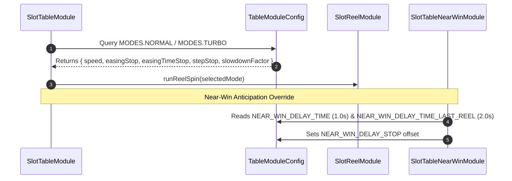

# 🌀 TableModuleConfig Speed Phase Configuration Breakdown

## 1. Speed Parameters Breakdown

```mermaid
sequenceDiagram
    autonumber
    participant Table as SlotTableModule
    participant Config as TableModuleConfig
    participant Reel as SlotReelModule
    participant NearWin as SlotTableNearWinModule

    Table->>Config: Query MODES.NORMAL / MODES.TURBO
    Config-->>Table: Returns { speed, easingStop, easingTimeStop, stepStop, slowdownFactor }
    Table->>Reel: runReelSpin(selectedMode)
    
    Note over Table,NearWin: Near-Win Anticipation Override
    NearWin->>Config: Reads NEAR_WIN_DELAY_TIME (1.0s) & NEAR_WIN_DELAY_TIME_LAST_REEL (2.0s)
    NearWin->>Config: Sets NEAR_WIN_DELAY_STOP offset
```
