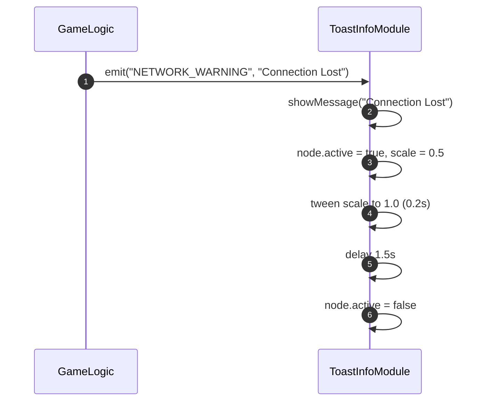

# 🔄 ToastInfoModule Lifecycle Flowchart

---

## 1. Sequence Flowchart

```mermaid
sequenceDiagram
    autonumber
    participant GL as GameLogic
    participant TIM as ToastInfoModule

    GL->>TIM: emit("NETWORK_WARNING", "Connection Lost")
    TIM->>TIM: showMessage("Connection Lost")
    TIM->>TIM: node.active = true, scale = 0.5
    TIM->>TIM: tween scale to 1.0 (0.2s)
    TIM->>TIM: delay 1.5s
    TIM->>TIM: node.active = false
```
