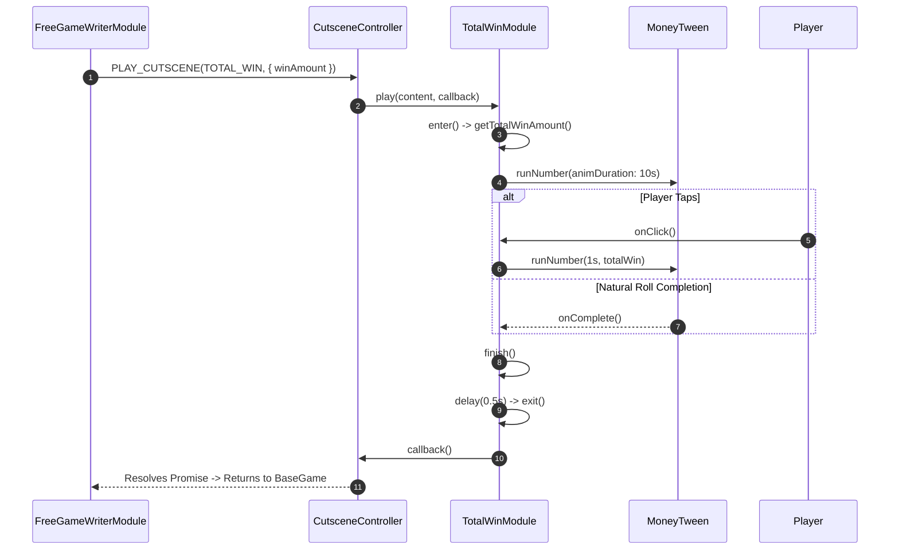

# 🔄 TotalWinModule Lifecycle Sequence Flowchart

---

## 1. Sequence Flowchart

```mermaid
sequenceDiagram
    autonumber
    participant Writer as FreeGameWriterModule
    participant CC as CutsceneController
    participant TWM as TotalWinModule
    participant MT as MoneyTween

    Writer->>CC: PLAY_CUTSCENE(TOTAL_WIN, { winAmount })
    CC->>TWM: play(content, callback)
    TWM->>TWM: enter() -> getTotalWinAmount()
    TWM->>MT: runNumber(animDuration: 10s)
    
    alt Player Taps
        Player->>TWM: onClick()
        TWM->>MT: runNumber(1s, totalWin)
    else Natural Roll Completion
        MT-->>TWM: onComplete()
    end
    
    TWM->>TWM: finish()
    TWM->>TWM: delay(0.5s) -> exit()
    TWM->>CC: callback()
    CC-->>Writer: Resolves Promise -> Returns to BaseGame
```
