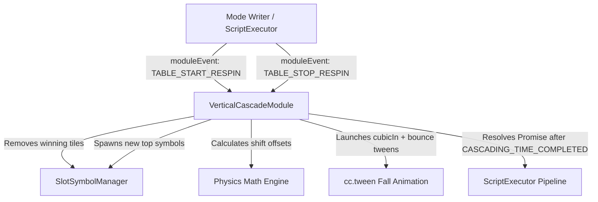

# 🏛️ VerticalCascadeModule Architectural Role & Physics Engine

---

## 1. Architectural Mission

`VerticalCascadeModule` is the master controller for the Cascade / Avalanche gameplay loop. It manages the removal of eliminated winning tiles, computes gravity fall trajectories for surviving symbols, spawns fresh top incoming symbols, and drives physics-based `cc.tween` drops with bounce easing and turbo awareness.

---

## 2. Key Responsibilities

1. **Two-Phase Respin Lifecycle**:
   - `startRespin()`: Eliminates hit symbols based on `traceWay`.
   - `stopRespin()`: Calculates drop offsets, spawns incoming symbols, and executes downward fall animations.
2. **Variable-Height & Mega Symbol Physics**:
   - Accurately tracks symbols spanning multiple cells (`size > 1`) and offsets landing positions.
3. **Turbo / Fast-to-Result Scaling**:
   - Halves falling duration and compresses bounce intervals when `gameSettings.isTurboActive` is true.
4. **Resilient Interrupt Handling (`resetAllEffectAndTasks`)**:
   - Reconstructs exact visual matrix state if the player initiates a new spin or triggers reconnect during an active drop.
