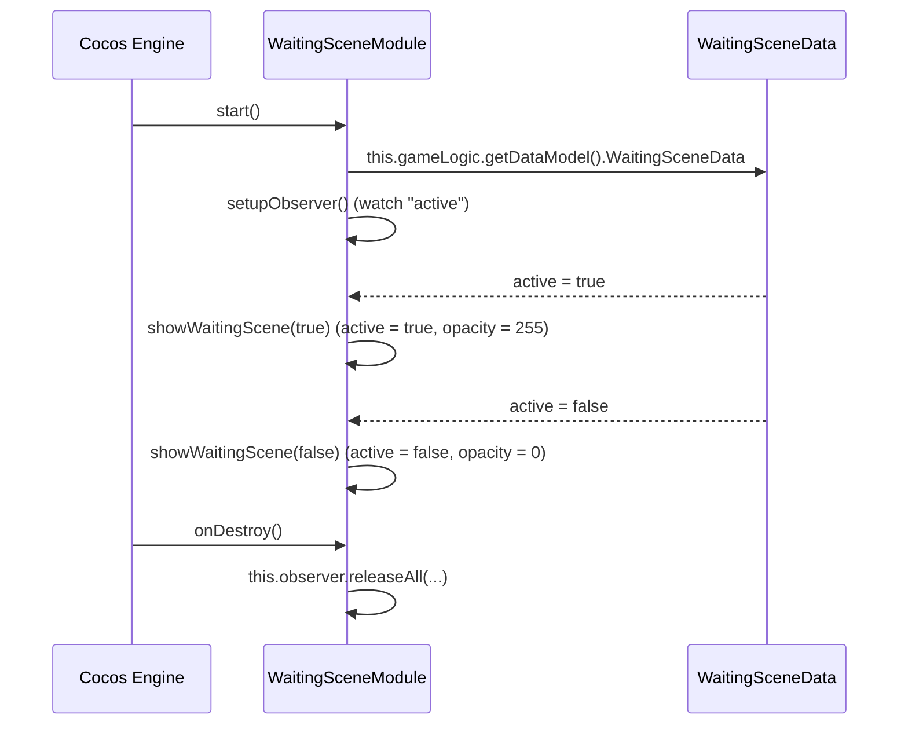

# 🔄 WaitingSceneModule Lifecycle Flowchart

```mermaid
sequenceDiagram
    participant Engine as Cocos Engine
    participant WSM as WaitingSceneModule
    participant Data as WaitingSceneData

    Engine->>WSM: start()
    WSM->>Data: this.gameLogic.getDataModel().WaitingSceneData
    WSM->>WSM: setupObserver() (watch "active")
    Data-->>WSM: active = true
    WSM->>WSM: showWaitingScene(true) (active = true, opacity = 255)
    Data-->>WSM: active = false
    WSM->>WSM: showWaitingScene(false) (active = false, opacity = 0)
    Engine->>WSM: onDestroy()
    WSM->>WSM: this.observer.releaseAll(...)
```
