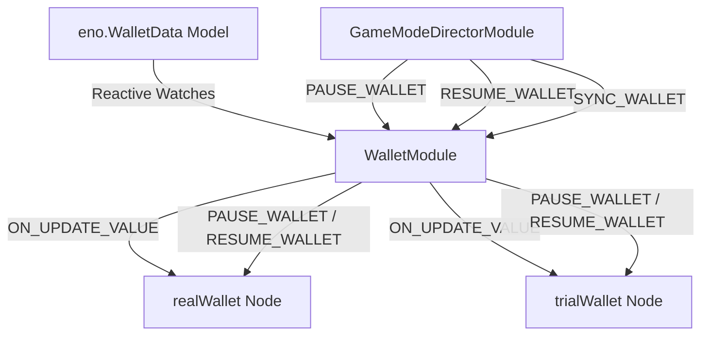

# 🏛️ WalletModule Architectural Role & Dual Currency Wallet Orchestration

---

## 1. Architectural Mission

`WalletModule` manages player cash balances under `Canvas/Director/UIManager/Wallet`. It orchestrates dual currency environments (**Real Wallet** vs **Trial Wallet**), synchronizing reactive balance data from `eno.WalletData` (`wallets.NORMAL` / `wallets.TRIAL`), managing tween pauses during big win roll-ups (`PAUSE_WALLET` / `RESUME_WALLET`), and handling seamless switching between demo and real money play.

---

## 2. Key Responsibilities

1. **Dual Currency Isolation (`realWallet` $\leftrightarrow$ `trialWallet`)**:
   - Routes balance events and displays to the active currency container based on `gameSettings.isTrialMode`.
2. **Rolling Number Coordination (`pauseWallet` / `resumeWallet`)**:
   - Pauses wallet balance count-ups while celebratory win cutscenes are rolling money, then synchronizes exact backend balance when win animation completes.
3. **Session Hydration & Mode Gating**:
   - Restricts wallet balance updates during Free Spins (`currentGameMode !== NORMAL_GAME`) to maintain base spin state integrity until free rounds terminate.
