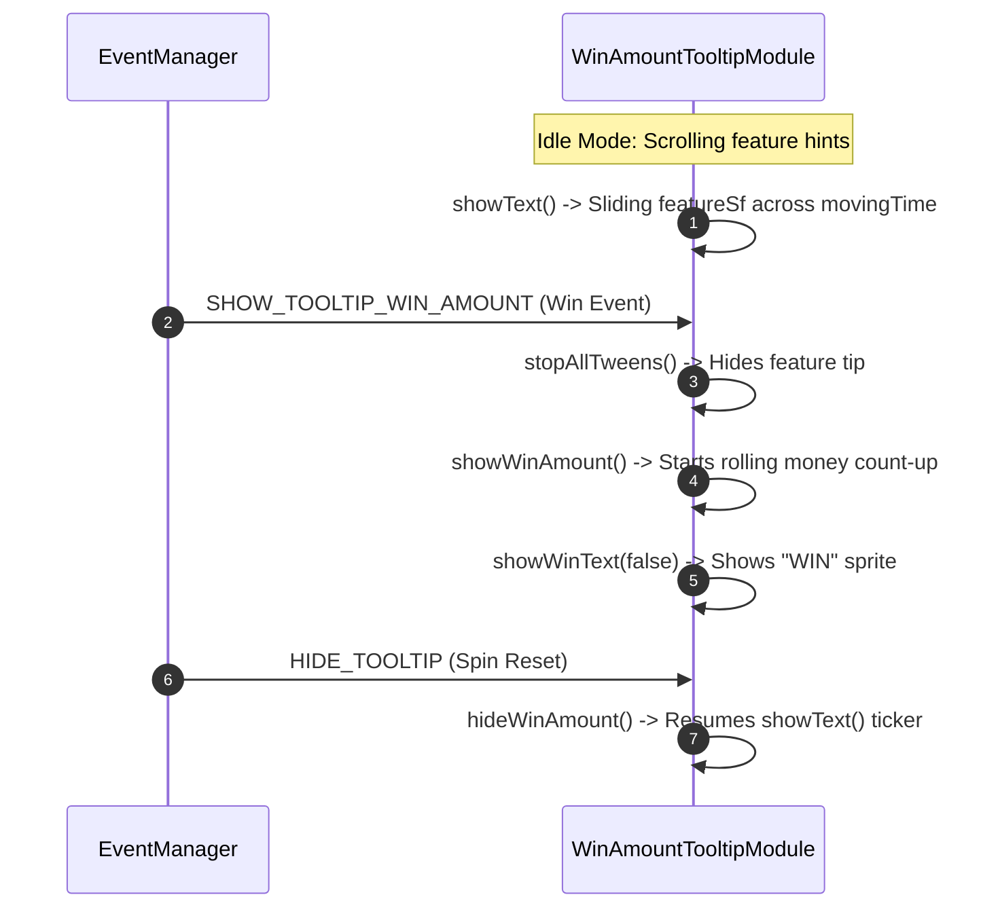

# 🔄 WinAmountTooltipModule Lifecycle Flowchart

---

## 1. Ticker & Win Presentation Flow

```mermaid
sequenceDiagram
    autonumber
    participant Engine as EventManager
    participant Tooltip as WinAmountTooltipModule

    Note over Tooltip: Idle Mode: Scrolling feature hints
    Tooltip->>Tooltip: showText() -> Sliding featureSf across movingTime

    Engine->>Tooltip: SHOW_TOOLTIP_WIN_AMOUNT (Win Event)
    Tooltip->>Tooltip: stopAllTweens() -> Hides feature tip
    Tooltip->>Tooltip: showWinAmount() -> Starts rolling money count-up
    Tooltip->>Tooltip: showWinText(false) -> Shows "WIN" sprite

    Engine->>Tooltip: HIDE_TOOLTIP (Spin Reset)
    Tooltip->>Tooltip: hideWinAmount() -> Resumes showText() ticker
```
