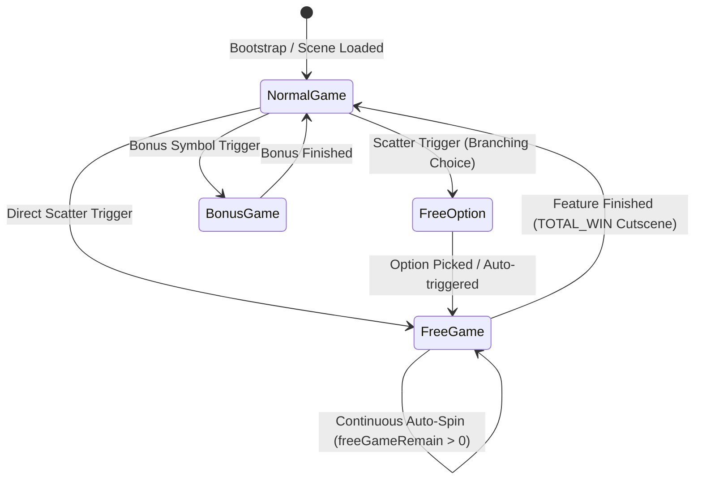
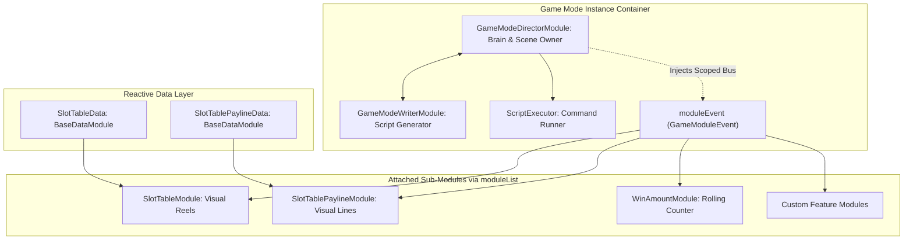
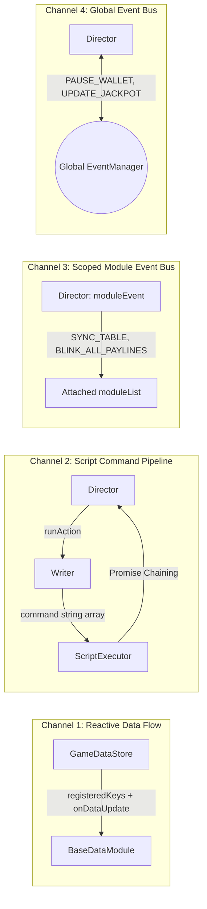

# 🎮 Game Mode Architecture, Subsystem Composition & Inter-Module Communication

---

## 1. Game Mode là gì? (Definition & Purpose of Game Modes)

Trong kiến trúc Cocos Creator Slot SDK (`cc-slot-module`), một **Game Mode** là một **hệ thống con tự chủ (Autonomous Subsystem / State)** đại diện cho một pha hoặc một chế độ chơi độc lập trong vòng đời game slot.

Mỗi Game Mode tự quản lý:
1. **Giao diện & Cột bảng (Reels & Layout)**: Bảng quay riêng, background riêng hoặc hiệu ứng theme đặc trưng.
2. **Kịch bản chuyển động (Script Pipeline)**: Quy trình spin, re-spin, cascade, thưởng, chốt kết quả riêng biệt do `WriterModule` lập trình.
3. **Âm thanh (Audio Profile)**: BGM và SFX theo phong cách của chế độ đó.
4. **Vòng lặp tương tác (Interaction Loop)**: Chế độ quay tự động liên tục (Free Game), chế độ chờ người chơi bấm nút (Normal Game), hoặc chế độ đếm ngược chọn thẻ (Free Option).



### Các Game Mode Tiêu chuẩn trong SDK:
* **`NORMAL_GAME` (Mode 1)**: Chế độ chơi chính (Base Game). Nhận lệnh quay từ nút Spin/AutoSpin/Turbo, trừ tiền ví cược, kích hoạt trả thưởng thường và chuyển cảnh khi trúng tính năng đặc biệt.
* **`FREE_GAME` (Mode 2)**: Chế độ quay miễn phí. Tự động quay liên tục mà không trừ tiền ví, sử dụng ma trận thưởng riêng, cập nhật bảng đếm số lượt quay còn lại (`freeSpinTimes`), cộng dồn tiền thắng lũy kế (`winAmountPS`) và hiện tổng kết (`TOTAL_WIN`).
* **`FREE_OPTION` (Mode 3)**: Màn hình tương tác cho phép người chơi chọn độ biến động (ví dụ: 20 Free Spins/2x Wild vs 10 Free Spins/5x Wild vs Mystery). Có bộ đếm ngược 15s tự động chọn.
* **`BONUS_GAME` (Mode 4)**: Trò chơi thưởng phụ (Pick-and-Win, Mini-wheel, Chest opening...).
* **`CASCADE_GAME` / `RESPIN_GAME`**: Các chế độ sụp biểu tượng (Tumble/Avalanche) hoặc giữ lại biểu tượng dính (Hold & Spin / Lock & Respin).

---

## 2. Giải phẫu một Game Mode Hoàn chỉnh (Game Mode Anatomy)

Một Game Mode trong `cc-slot-module` không phải là một Component đơn lẻ, mà là một **Tổ hợp Hợp phần (Component Cluster)** phối hợp chặt chẽ với nhau:

```text
Canvas/Director/GameMode/NormalGameDirector (Chứa GameModeDirectorModule)
├── NormalGameDirectorModule (Bộ não điều phối / Scene Owner)
├── NormalGameWriterModule (Bộ não lập kịch bản chuỗi lệnh)
├── ScriptExecutor (Cỗ máy chạy queue lệnh bất đồng bộ)
└── moduleList (Danh sách các Component giao diện gắn kèm)
    ├── Table (SlotTableModule, SlotReelModule, SlotSymbolManager)
    ├── TableData (SlotTableData - Nhận dữ liệu ma trận phản ứng)
    ├── Payline (SlotTablePaylineModule - Kẻ line và chớp biểu tượng)
    ├── PaylineData (SlotTablePaylineData - Nhận dữ liệu payLines, winAmount)
    ├── WinAmount (WinAmountModule - Số lăn, đếm tiền)
    └── SlotButton (SlotButtonModule - Nút điều khiển quay)
```



### 3 Thành phần Cốt lõi của một Game Mode:
1. **`GameModeDirectorModule` (The Orchestrator)**:
   - Nắm giữ vòng đời của Mode (`init`, `enter`, `onDestroy`).
   - Cung cấp các phương thức thực thi lệnh thực tế (`_startSpinningTable`, `_stopSpinningTable`, `_showWinPayline`, `_gameExit`...).
   - Tạo ra bus sự kiện cục bộ `this.moduleEvent = new GameModuleEvent()` và tiêm (inject) vào toàn bộ các module con trong `moduleList`.
2. **`GameModeWriterModule` (The Planner)**:
   - Thuần túy đọc dữ liệu từ `dataStore.playSession` để sản xuất ra mảng danh sách tên lệnh `string[]`.
   - Hoàn toàn độc lập với hiển thị đồ họa (không thao tác Node hay Tween). Dễ dàng viết Unit Test kịch bản.
3. **`BaseDataModule` Subclasses (The Data Observers)**:
   - Đặt cùng node với các presentation component (`SlotTableData` cùng node với `SlotTableModule`).
   - Đăng ký nhận khóa dữ liệu từ `GameDataStore` qua `registeredKeys` (`matrix`, `payLines`, `winAmount`).

---

## 3. 4 Kênh Giao Tiếp Giữa Các Module (Inter-Module Communication Matrix)

Để các module hoàn toàn tách rời (decoupled), dễ tái sử dụng và kiểm thử độc lập, `cc-slot-module` thiết kế **4 kênh liên lạc đa tầng**:



### Kênh 1: Reactive Data Flow (`GameDataStore` ➔ `BaseDataModule`)
- **Bản chất**: Cơ chế truyền dữ liệu một chiều không qua chuỗi sự kiện chuỗi (Zero-Event-Overhead).
- **Cách hoạt động**:
  1. Khi server gửi phản hồi spin, Director gọi `dataStore.parseDataPS(data)` và `dataStore.updateDataModules()`.
  2. `GameDataStore` lặp qua danh sách `_dataModules`: nếu key trong `module.registeredKeys` có trong session, nó tự động gọi `module.onDataUpdate(key, deepClonedValue)`.
  3. Giá trị truyền đi được **Deep Clone** (`JSON.parse(JSON.stringify(value))`) để cô lập trạng thái, tránh trường hợp module UI làm biến dạng dữ liệu gốc của game.

### Kênh 2: Command Script Pipeline (`Director` ➔ `Writer` ➔ `ScriptExecutor`)
- **Bản chất**: Mẫu thiết kế Command Pattern kết hợp Async Promise Chaining.
- **Cách hoạt động**:
  1. Director gọi `this.runAction("ActionName")` (ví dụ: `runAction("SpinTrigger")`).
  2. Writer dựa vào `playSession` (có trúng BigWin không, có nổ Jackpot không, còn Free Spin không) để trả về mảng các bước:
     ```typescript
     ["_beforeSpinStart", "_syncPlaySessionData", "_resetOnSpin", "_startSpinningTable"]
     ```
  3. `ScriptExecutor` duyệt tuần tự từng lệnh string, tìm method tương ứng trên Director và thực thi `await director._method()`. Khi lệnh trước hoàn thành (Promise resolved), lệnh tiếp theo mới được chạy.

### Kênh 3: Scoped Module Event Bus (`this.moduleEvent: GameModuleEvent`)
- **Bản chất**: Kênh phát sóng sự kiện nội bộ, cô lập trong phạm vi của 1 Game Mode.
- **Cách hoạt động**:
  - Khi `GameModeDirectorModule` khởi tạo, nó tạo một `new GameModuleEvent()` và gọi `setupModule(this.moduleEvent)` trên từng module trong `this.moduleList`.
  - Các sự kiện đặc thù của bảng quay chỉ bắn trong mode này: `SYNC_TABLE`, `TABLE_START_SPIN`, `TABLE_STOP_SPIN`, `BLINK_ALL_PAYLINES`, `SHOW_ALL_PAYLINES`, `CLEAR_PAYLINES`.
  - **Lợi ích**: Giúp Normal Game và Free Game có thể dùng chung một loại Table hoặc hai Table khác nhau mà không bao giờ bị bắn nhầm sự kiện qua lại.

### Kênh 4: Global Event Bus (`this.eventManager: EventManager`)
- **Bản chất**: Kênh phát sóng sự kiện toàn cục xuyên suốt ứng dụng.
- **Cách hoạt động**:
  - Dùng để liên lạc giữa các hệ thống lớn không nằm trong cùng một Game Mode:
    - **Wallet**: `GameUIEvents.WALLET.PAUSE_WALLET`, `GameUIEvents.WALLET.RESUME_WALLET`.
    - **Jackpot**: `GameUIEvents.JACKPOT.UPDATE_JACKPOT_VALUE`, `GameUIEvents.JACKPOT.PAUSE_JACKPOT`.
    - **Cutscenes / Dialogs**: `GameUIEvents.CUTSCENES.PLAY_CUTSCENE`, `GameUIEvents.CUTSCENES.CLOSE_CUTSCENE`.
    - **Game Mode Switch**: `GameUIEvents.GAME_MODE.SWITCH_GAME_MODE`, `GameUIEvents.GAME_MODE.EXIT_GAME_MODE`.

---

## 4. Bảng So Sánh 4 Kênh Giao Tiếp

| Kênh Giao Tiếp | Tốc độ / Cơ chế | Phạm vi (Scope) | Dữ liệu truyền tải | Sử dụng khi nào? |
| :--- | :--- | :--- | :--- | :--- |
| **1. Reactive Data** | Gọi hàm trực tiếp (<0.1ms), Deep-clone | Toàn bộ Data Modules | Data slices (`matrix`, `payLines`) | Cập nhật dữ liệu từ Server vào các Module Data. |
| **2. Command Script**| Promise chaining bất đồng bộ | Nội bộ Director & Writer | Tên hàm + Data context | Lập trình chuỗi thứ tự diễn hoạt của ván quay. |
| **3. Scoped `moduleEvent`**| Event Emitter nội bộ | Trong 1 Game Mode (`moduleList`) | Event payloads | Điều khiển Table, Paylines, HUD của riêng Mode đó. |
| **4. Global `eventManager`**| Event Emitter toàn cục | Xuyên suốt toàn bộ Scene | Global payloads | Đổi mode, cập nhật Ví, Jackpot, bật Dialog Cutscene. |
