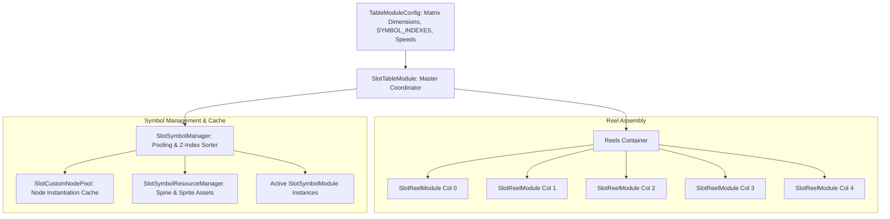
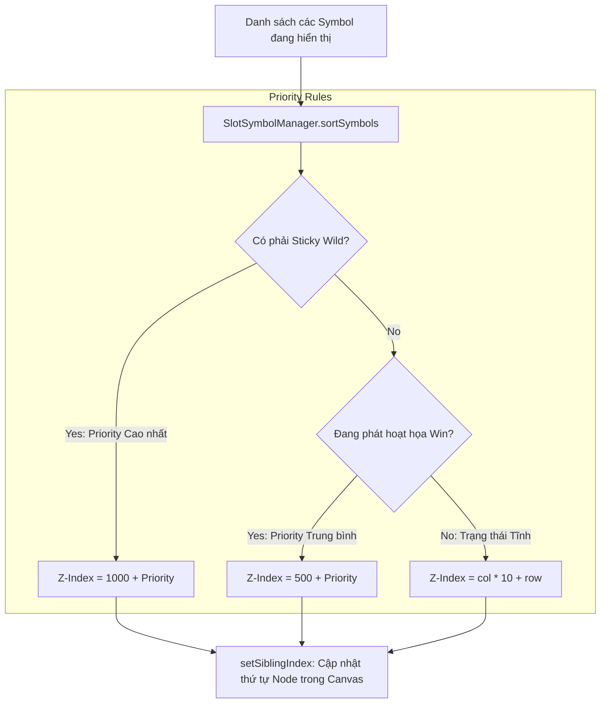

# 🎰 Table, Reels & Symbol Rendering Engine Architecture

---

## 1. Tổng quan Cỗ máy Bảng quay (Table Engine Overview)

Hệ thống Bảng quay (**Table Engine**) là trái tim đồ họa của game Slot trong `cc-slot-module`. Nó chịu trách nhiệm render toàn bộ ma trận biểu tượng, thực thi hiệu ứng cuộn vô tận (infinite blur spin), dừng cột nảy vật lý (bounce back stop), sắp xếp thứ tự hiển thị (Z-Index Layering) và hỗ trợ các cơ chế phức tạp như biểu tượng khổng lồ (Mega Symbols) hoặc ma trận xếp tầng (Cascade).



---

## 2. 7 Hợp phần Cốt lõi của Table Engine

| Hợp phần | Component / Script | Vai trò Trọng tâm |
| :--- | :--- | :--- |
| **1. Bộ điều khiển Bảng** | `SlotTableModule` | Quản lý toàn bộ danh sách các cột (`reelList`), tiếp nhận sự kiện `TABLE_START_SPIN`, `TABLE_STOP_SPIN`, `SYNC_TABLE` và đồng bộ dừng cột. |
| **2. Cấu hình Hình học** | `TableModuleConfig` | Định nghĩa số cột/dòng (`TABLE_FORMAT`), tọa độ hiển thị từng ô (`SYMBOL_INDEXES`), cấu hình tốc độ (`MODES.NORMAL`, `MODES.TURBO`). |
| **3. Bộ điều khiển Cột** | `SlotReelModule` | Thực hiện chuyển động cuộn xoay vô tận của 1 cột, di chuyển các symbol ảo (blur), áp dụng easing nảy khi dừng (`BOUNCE_EASING`). |
| **4. Quản lý Vòng đời Symbol** | `SlotSymbolManager` | Cấp phát (`getSymbolByIndex`), thu hồi (`returnSymbol`), sắp xếp thứ tự đè lớp (`sortSymbols`), quản lý biểu tượng dính (Sticky Wilds). |
| **5. Thực thể Biểu tượng** | `SlotSymbolModule` | Component đại diện cho 1 ô Symbol trên bảng: chứa Sprite tĩnh, Spine hoạt họa, Spine Blur và các hàm `changeToSymbol()`, `playAnimation()`. |
| **6. Bộ tái sử dụng Node** | `SlotCustomNodePool` | Quản lý Node Pool cho từng loại Symbol, ngăn chặn rác bộ nhớ (Garbage Collection spikes) khi quay liên tục. |
| **7. Quản lý Tài nguyên** | `SlotSymbolResourceManager`| Tải trước và lưu trữ khung xương Spine SkeletonData, SpriteAtlas của toàn bộ bộ ký hiệu trong game. |

---

## 3. Hệ tọa độ Ma trận & Vùng đệm Ẩn (Matrix Geometry & Buffer Rows)

### 3.1. Hệ tọa độ Ma trận Chuẩn: `[col][row]`
Trong `cc-slot-module`, ma trận game luôn được biểu diễn dưới dạng mảng 2 chiều theo cột trước, dòng sau:
```typescript
matrix[col][row]
```
- `col`: Chỉ số cột từ trái sang phải (`0` đến `COLS - 1`).
- `row`: Chỉ số dòng từ dưới lên trên hoặc từ trên xuống dưới tùy game (thường `0` là dòng đáy, `ROWS - 1` là dòng đỉnh).

```text
       Col 0      Col 1      Col 2      Col 3      Col 4
Row 2: [0][2]     [1][2]     [2][2]     [3][2]     [4][2]   <-- Dòng hiển thị trên cùng
Row 1: [0][1]     [1][1]     [2][1]     [3][1]     [4][1]   <-- Dòng hiển thị giữa
Row 0: [0][0]     [1][0]     [2][0]     [3][0]     [4][0]   <-- Dòng hiển thị đáy
```

### 3.2. Vùng đệm Ẩn (Buffer Rows: `topBuffer` & `bottomBuffer`)
Để tạo cảm giác Symbol trượt mượt mà vào và ra khỏi khung nhìn (Reel Viewport) mà không bị "chớp tắt" (pop-in / pop-out) đột ngột:
- `topBuffer`: Các dòng Symbol ẩn nằm phía trên đỉnh cột. Khi cột cuộn xuống, Symbol trong topBuffer sẽ trượt dần vào màn hình.
- `bottomBuffer`: Các dòng Symbol ẩn nằm phía dưới đáy cột. Symbol trượt qua đáy sẽ đi vào vùng này trước khi được thu hồi về Pool.

```text
+---------------------------------------------------+
|               TOP BUFFER (Ẩn ngoài khung nhìn)     |
+===================================================+
|           REEL VIEWPORT (Vùng người chơi nhìn thấy)|
|                                                   |
|   [Col 0]     [Col 1]     [Col 2]     [Col 3]     |
|                                                   |
+===================================================+
|             BOTTOM BUFFER (Ẩn ngoài khung nhìn)   |
+---------------------------------------------------+
```

---

## 4. Cơ chế Sắp xếp Thứ tự Đè Lớp (Z-Index Layer Priority Sorting)

Khi các biểu tượng trên bảng phát hoạt họa trúng thưởng hoặc bung hiệu ứng thắng lớn (Spine expands), nếu không có cơ chế phân lớp, các biểu tượng ở cột sau có thể bị biểu tượng cột trước che mất hoặc ngược lại.

`SlotSymbolManager.sortSymbols()` giải quyết vấn đề này dựa trên **Layer Config Priority**:



---

## 5. Xử lý Biểu tượng Khổng lồ (Mega Symbols / Big Symbols)

Với các game có Symbol chiếm nhiều ô (ví dụ: Wild 2x2, 3x3, hoặc biểu tượng dài 1x3):
1. **Parent Reel Locking**: Symbol khổng lồ được gắn vào cột gốc (Anchor Column, thường là cột góc trái dưới cùng).
2. **Buffer Spacing**: `TableModuleConfig` tính toán khoảng cách đệm mở rộng trên `topBuffer` để tránh mép đỉnh của Mega Symbol bị cắt (clipping) khi cuộn vào khung hình.
3. **Multi-Index Mapping**: Khi tính thưởng, `SlotTablePaylineModule` tự động chiếu tọa độ của Mega Symbol vào toàn bộ các ô `[col][row]` mà nó bao phủ.
