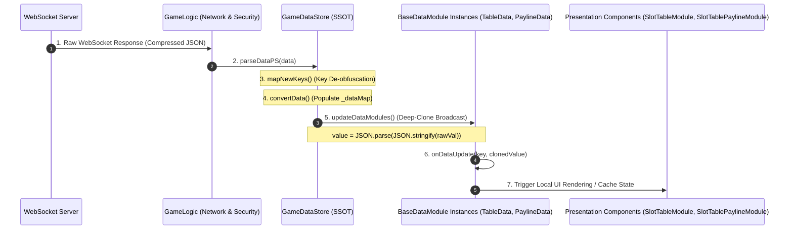
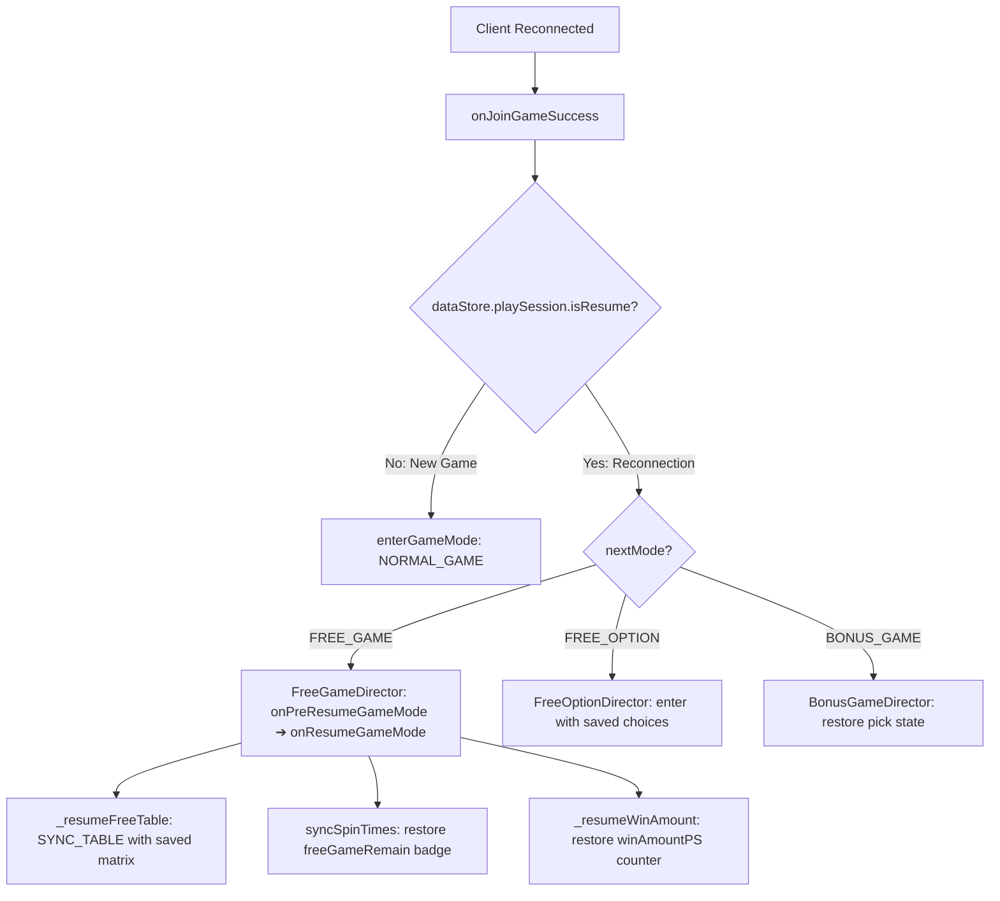

# 🔄 Reactive Data Flow, State Immutability & Reconnection Architecture

---

## 1. Hành trình Toàn vẹn của Gói tin Dữ liệu Server (Data Ingestion Pipeline)

Toàn bộ luồng dữ liệu trong `cc-slot-module` tuân thủ nguyên lý **Single Source of Truth (SSOT)** kết hợp **Phản ứng Dữ liệu Một Chiều (Unidirectional Reactive Data Flow)**.

Dưới đây là hành trình từng bước từ khi gói tin nhị phân/JSON cập bến Client cho đến khi biểu hiện lên màn hình:



---

## 2. Nguyên lý Cách ly Bất biến bằng Deep Clone (State Immutability Isolation)

Trong các game Slot chạy thời gian thực, nhiều module cùng quan tâm đến một mảng dữ liệu (ví dụ: cả `SlotTableData`, `SlotTablePaylineData`, và `CascadeModuleData` đều đọc `matrix`).

Nếu truyền tham chiếu (Object Reference) trực tiếp:
- Khi `SlotTableModule` xóa 1 phần tử hoặc thay đổi symbol trong mảng `matrix` để làm hoạt họa, nó sẽ vô tình làm hỏng dữ liệu gốc của `SlotTablePaylineModule`.

`GameDataStore.updateDataModules()` triệt tiêu hoàn toàn rủi ro này bằng cơ chế **Deep Clone Immutability**:
```typescript
updateDataModules(): void {
    this.convertData(this.playSession);
    this.gameModeData.set(this.currentGameMode, this.playSession);
    this._dataModules.forEach((module) => {
        for (const key of module.registeredKeys) {
            if (this._dataMap.has(key)) {
                let value = this._dataMap.get(key);
                if (Array.isArray(value) || (typeof value === 'object' && value !== null)) {
                    value = JSON.parse(JSON.stringify(value)); // <-- CÔ LẬP BỘ NHỚ
                }
                module.onDataUpdate(key, value);
            } else {
                module.clearDataWithKey(key);
            }
        }
    });
}
```

---

## 3. Khử Nén Khóa Dữ liệu Di động (`mapNewKeys`)

Để tiết kiệm băng thông 3G/4G trên thiết bị di động, backend Slot thường nén tên biến thành 2-4 ký tự (ví dụ: `cna`, `pMul`, `mulF`, `fgr`).

Tại tầng `GameDataStore`, lập trình viên override `mapDataPS()` để chuyển đổi các ký tự viết tắt này thành thuộc tính chuẩn của SDK:

```typescript
@ccclass
export class GameDataStore9666 extends GameDataStore {
    override parseDataPS(data: any): void {
        super.parseDataPS(data);
        this.playSession = this.mapDataPS(this.playSession);
    }

    mapDataPS(data: any): any {
        return this.mapNewKeys(data, {
            "cna": "currentNormalGameWinAmount",
            "cfa": "currentFreeGameWinAmount",
            "pMul": "previousMultiplier",
            "mulF": "freeGameMultiplier",
            "fgr": "freeGameRemain"
        });
    }
}
```

---

## 4. Kiến trúc Phục hồi Trạng thái khi Mất kết nối (Reconnection Architecture: `isResume`)

Khi người chơi bị rớt mạng hoặc refresh trình duyệt giữa chừng (ví dụ: đang ở vòng 3 trong 10 vòng Free Spins, hoặc đang chọn thẻ Free Option):



### Các bước Phục hồi Chuẩn:
1. **Khôi phục Bảng quay (`_resumeNormalTable` / `_resumeFreeTable`)**: Dựng lại chính xác các biểu tượng đang dừng trên màn hình trước khi rớt mạng bằng lệnh `SYNC_TABLE`.
2. **Khôi phục Bộ đếm Số vòng quay (`syncSpinTimes`)**: Đọc `freeGameRemain` để hiển thị đúng số vòng còn lại trên Badge HUD (tránh hiện lại số 10 ban đầu).
3. **Khôi phục Tiền thắng Tích lũy (`_resumeWinAmount`)**: Đọc `winAmountPS` để hiển thị số tiền đã thắng được qua các vòng trước lên ô Win Amount.
4. **Tiếp tục Vòng lặp Auto-Spin**: Bật lại cơ chế tự động quay tiếp tục phiên chơi mà không cần người chơi thao tác lại từ đầu.
