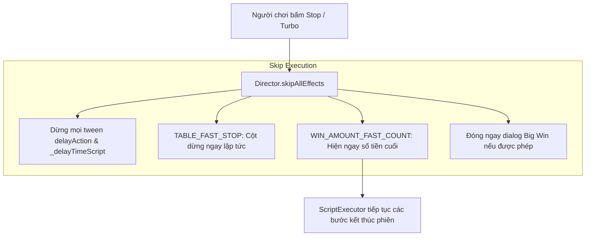

# 📜 Script Execution Engine, Writer Command Synthesis & Async Pipeline

---

## 1. Tam Giác Điều Phối Kịch Bản (The Scripting Triad)

Trong các game slot truyền thống, việc lồng ghép hàng chục callback (`setTimeout`, callback hell, lồng `tween.call()`) khiến code trở nên rối rắm, khó bảo trì và dễ gây ra race conditions.

`cc-slot-module` giải quyết triệt để vấn đề này bằng **Mẫu Thiết kế Command Pattern kết hợp Chuỗi Promise Bất đồng bộ (Async Promise Chaining)** thông qua **Tam Giác Điều Phối**:

```mermaid
graph LR
    subgraph 1. The Director (Scene Owner)
        Dir[GameModeDirectorModule]
        Dir -->|1. runAction 'SpinTrigger'| Wrt
        Dir <---|4. Executes method Promises| Exec
    end

    subgraph 2. The Writer (Script Planner)
        Wrt[GameModeWriterModule]
        Wrt -->|2. Returns string command array| Exec
    end

    subgraph 3. The Executor (Queue Runner)
        Exec[ScriptExecutor]
        Exec -->|3. Iterates commands sequentially| Dir
    end
```

---

## 2. Cách Hoạt Động của Chuỗi Lệnh (How Command Arrays Are Evaluated)

### Bước 1: Director phát tín hiệu kích hoạt hành động
```typescript
// Trong GameModeDirectorModule
onBeforeSpinStart(): Promise<void> {
    return this.runAction("SpinTrigger");
}
```

### Bước 2: Writer phân tích dữ liệu và sinh danh sách lệnh
`Writer` kiểm tra `this.dataStore.playSession` để quyết định chuỗi lệnh phù hợp:
```typescript
// Trong GameModeWriterModule
makeScriptSpinTrigger(): Array<string | object> {
    return [
        "_beforeSpinStart",
        "_syncPlaySessionData",
        "_resetOnSpin",
        "_startSpinningTable"
    ];
}
```

### Bước 3: ScriptExecutor thực thi tuần tự từng bước
`ScriptExecutor` sử dụng cơ chế Promise chaining để gọi các method có tên tương ứng trên `Director`:
```typescript
// Cơ chế lõi của ScriptExecutor
async runScript(commands: Array<string | object>, targetDirector: any): Promise<void> {
    for (const cmd of commands) {
        if (typeof cmd === "string") {
            const method = targetDirector[cmd];
            if (typeof method === "function") {
                await method.call(targetDirector); // Chờ Promise trước resolve mới đi tiếp
            }
        } else if (typeof cmd === "object") {
            // Hỗ trợ truyền tham số động: { command: "_showCutscene", data: cutscenePayload }
            const { command, data } = cmd as any;
            await targetDirector[command].call(targetDirector, data);
        }
    }
}
```

---

## 3. Cơ chế Ngắt và Tua Nhanh (Turbo Mode & Skip All Effects)

Khi người chơi bật chế độ **Turbo** hoặc bấm nút **Stop** nhanh để bỏ qua diễn hoạt:



### Cách triển khai an toàn:
1. Mọi hàm delay trong Director (`delayAction(time)`, `_delayTimeScript(time)`) đều giữ handle tween (`this._tweenDelayTimeScript`).
2. Khi `skipAllEffects()` được gọi, nó hủy ngay tween này và lập tức `resolve()` Promise để ScriptExecutor không bị treo (hang) mà chuyển ngay sang bước tiếp theo.
