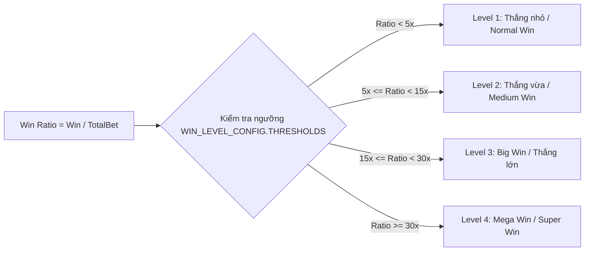
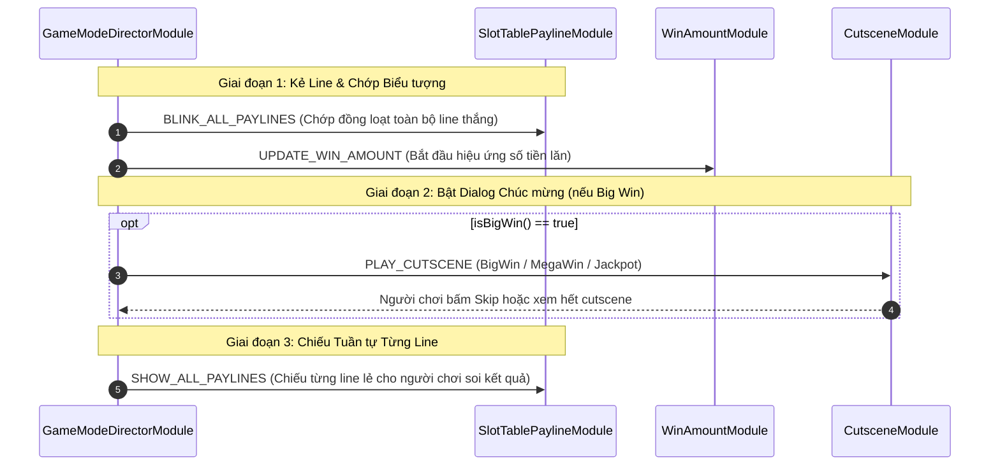

# 🏆 Win Evaluation, Payline Presentation & Celebration Hierarchy

---

## 1. Phân Cấp Tính Thưởng (Win Level Calculation)

Hệ thống tính thưởng trong `cc-slot-module` phân loại chiến thắng thành các cấp bậc dựa trên **Tỷ lệ Tiền thắng / Tổng cược (Multiplier Ratio)**:

$$\text{Win Ratio} = \frac{\text{Win Amount}}{\text{Total Bet}}$$

### Bảng Cấu hình Tiêu chuẩn (`WIN_LEVEL_CONFIG`):
| Cấp bậc (Win Level) | Ngưỡng Nhân Cược | Thời gian Số lăn (`COUNT_MONEY_TIME`) | Thời gian Chiếu Line (`WIN_LINE_TIME`) | Hiển thị Dialog (Cutscene) |
| :--- | :--- | :--- | :--- | :--- |
| **Level 1 (Small Win)** | $< 5\times$ | 0.5s | 1.0s | Không (Chỉ chớp line) |
| **Level 2 (Medium Win)**| $5\times - 15\times$ | 2.0s | 2.0s | Không (Số lăn nhanh) |
| **Level 3 (Big Win)** | $15\times - 30\times$ | 4.0s | 4.0s | Bật Popup `BIG_WIN` |
| **Level 4 (Mega / Super)** | $> 30\times$ | 6.0s - 10.0s | 6.0s - 8.0s | Bật Popup `MEGA_WIN` / `SUPER_WIN` |

---

## 2. Quy Trình Trình Diễn Thắng (Win Presentation Pipeline)

Khi kết thúc vòng quay có thưởng, quy trình biểu diễn được chia làm 3 giai đoạn phối hợp:

### Chi tiết 3 Giai đoạn:
1. **Chớp Tổng Hợp (`BLINK_ALL_PAYLINES`)**:
   - Tất cả các Symbol tham gia vào bất kỳ line thắng nào sẽ cùng phát hoạt họa Win / Bung Spine đồng thời.
   - Giúp người chơi nắm bắt ngay quy mô thắng của toàn bảng.
2. **Ăn Mừng Đỉnh Điểm (`Cutscene & Rolling Money`)**:
   - `WinAmountModule` bắt đầu đếm số từ 0 lên tiền thắng với âm thanh tiền xu rơi (`Coin Roll SFX`).
   - Nếu là Big Win / Jackpot: Bật Dialog toàn màn hình với hiệu ứng hạt vàng (Coin Fountains) và hoạt họa nhân vật chính.
3. **Chiếu Tuần Tự (`SHOW_ALL_PAYLINES`)**:
   - Sau khi kết thúc đếm tiền, hệ thống chuyển sang chế độ nhàn rỗi (Idle Payline Cycling): lần lượt sáng từng đường line và làm mờ các ô còn lại để người chơi quan sát chi tiết paytable từng dòng.
