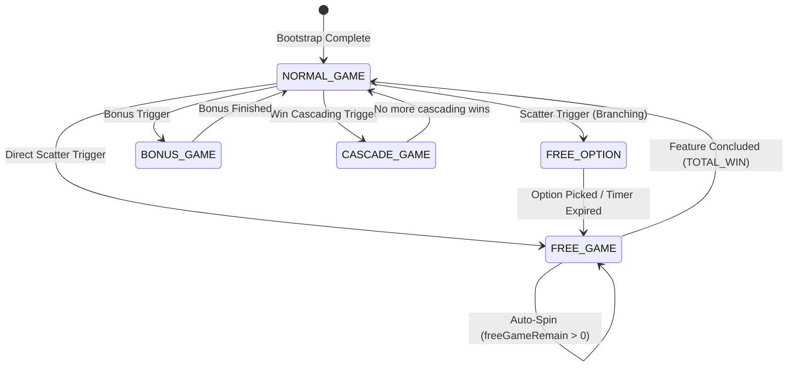

# 🎮 Game Mode Concepts & Standard Types

---

## 1. Bản chất của Game Mode: Finite State Machine (FSM)

Trong kiến trúc Slot Framework, một **Game Mode** là một trạng thái độc lập trong cỗ máy trạng thái hữu hạn (**Finite State Machine - FSM**).

Mỗi Game Mode là một hệ sinh thái con tự quản lý hoàn chỉnh:
* **Giao diện & Theme**: Bảng quay riêng, background riêng, animation chuyển cảnh.
* **Quy tắc Trò chơi & Trả thưởng**: Tỷ lệ cược, bảng thanh toán (Paytable), hệ số nhân (Multiplier).
* **Vòng đời Kịch bản (Script Execution)**: Quy trình điều phối spin, cascade, chớp line và tổng kết.
* **Âm thanh (Audio Profile)**: BGM và SFX đặc trưng của chế độ đó.

---

## 2. Phân loại 5 Game Mode Chuẩn trong Framework

### 2.1. `NORMAL_GAME` (Base Game Mode)
- **Mã Enum**: `GAME_MODE_ENUM.NORMAL_GAME` (Giá trị: `1`).
- **Đặc điểm**:
  - Chế độ chơi cơ sở, luôn được khởi động đầu tiên khi vào game.
  - Nhận tương tác trực tiếp từ người chơi thông qua nút Quay (Spin), Quay Tự Động (Auto Spin), Quay Siêu Tốc (Turbo).
  - Trừ tiền ví (`Wallet`) trên mỗi lần quay và kiểm tra kích hoạt các tính năng đặc biệt (Scatters, Bonus symbols).

### 2.2. `FREE_GAME` (Free Spins Feature Mode)
- **Mã Enum**: `GAME_MODE_ENUM.FREE_GAME` (Giá trị: `2`).
- **Đặc điểm**:
  - Chế độ quay miễn phí tự động liên tục mà không trừ tiền ví người chơi.
  - Quản lý bộ đếm số lượt quay còn lại (`freeSpinTimes` / `freeGameRemain`).
  - Cộng dồn tiền thắng lũy kế của toàn bộ vòng quay miễn phí (`winAmountPS`).
  - Hỗ trợ tính năng Retrigger (thêm lượt quay) và kết thúc bằng Dialog tổng kết `TOTAL_WIN`.

### 2.3. `FREE_OPTION` (Player Volatility Selection Mode)
- **Mã Enum**: `GAME_MODE_ENUM.FREE_OPTION` (Giá trị: `3`).
- **Đặc điểm**:
  - Màn hình tương tác hiển thị danh sách các thẻ lựa chọn (ví dụ: 20 Free Spins nhân 2x-5x Wild vs 10 Free Spins nhân 5x-10x Wild vs Thẻ Bí Ẩn Mystery).
  - Tích hợp đồng hồ đếm ngược 15 giây (`startCountDown()`). Nếu người chơi không chọn, hệ thống tự động chọn ngẫu nhiên 1 thẻ (`_runAutoTrigger()`).
  - Gửi yêu cầu mạng `SEND_FREE_OPTION_REQUEST` lên Server để nhận cấu hình Free Spins tương ứng.

### 2.4. `BONUS_GAME` (Pick & Win / Mini-Game Mode)
- **Mã Enum**: `GAME_MODE_ENUM.BONUS_GAME` (Giá trị: `4`).
- **Đặc điểm**:
  - Trò chơi phụ tương tác như chọn rương báu (Chest Picking), quay bánh xe may mắn (Fortune Wheel), hoặc mini-game thẻ bài.
  - Sử dụng bảng riêng (`BonusGameTableModule`) và các vật phẩm tương tác (`BonusGameItemModule`).

### 2.5. `CASCADE_GAME` (Avalanche / Tumble Mode)
- **Đặc điểm**:
  - Chế độ sụp đổ biểu tượng: các Symbol trúng thưởng phát nổ và biến mất, các biểu tượng phía trên rơi xuống lấp đầy ô trống.
  - Mỗi bước sụp là một Step con được điều phối bởi `CascadeModuleData` và `CascadeModuleDirector`.
