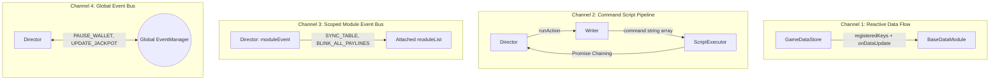

# 📡 Inter-Module Communication: 4 Channels Architecture

---

## 1. Tổng quan 4 Kênh Giao Tiếp Đa Tầng

Để đảm bảo kiến trúc Slot Framework có độ linh hoạt tối đa (High Cohesion, Low Coupling), `cc-slot-module` phân chia toàn bộ luồng thông tin trong game thành **4 kênh giao tiếp chuyên biệt**:

---

## 2. Chi tiết 4 Kênh Giao Tiếp

### 🔹 Kênh 1: Reactive Data Flow (`GameDataStore` ➔ `BaseDataModule`)
- **Cơ chế**: Gọi hàm trực tiếp qua mảng Observer (`_dataModules: Set<BaseDataModule>`), zero event string overhead.
- **Dữ liệu truyền**: Data slice nguyên bản từ Server (`matrix`, `payLines`, `winAmount`) đã được **Deep Clone** (`JSON.parse(JSON.stringify(val))`).
- **Mục đích**: Cung cấp dữ liệu trạng thái mới nhất cho các module hiển thị mà không sợ bị sửa đổi dữ liệu gốc ngoài ý muốn.

### 🔹 Kênh 2: Command Script Pipeline (`Director` ➔ `Writer` ➔ `ScriptExecutor`)
- **Cơ chế**: Mẫu thiết kế Command Pattern kết hợp Async Promise Chaining.
- **Dữ liệu truyền**: Mảng danh sách tên hàm cần thực thi (ví dụ: `["_beforeSpinStart", "_startSpinningTable", "_stopSpinningTable"]`).
- **Mục đích**: Tách rời hoàn toàn **Luồng logic kịch bản (Writer)** ra khỏi **Hiển thị đồ họa (Director)**. Cho phép dễ dàng viết Unit Test cho kịch bản mà không cần dựng Scene Cocos.

### 🔹 Kênh 3: Scoped Module Event Bus (`this.moduleEvent: GameModuleEvent`)
- **Cơ chế**: Event Bus nội bộ được Director tạo ra bằng `new GameModuleEvent()` và tiêm vào toàn bộ `this.moduleList`.
- **Sự kiện tiêu biểu**: `SYNC_TABLE`, `TABLE_START_SPIN`, `TABLE_STOP_SPIN`, `BLINK_ALL_PAYLINES`, `SHOW_ALL_PAYLINES`, `CLEAR_PAYLINES`.
- **Mục đích**: Cách ly hoàn toàn các sự kiện đồ họa giữa Normal Game, Free Game và Bonus Game. Bảng quay của Free Game nhận lệnh từ Free Game Director mà không bao giờ bị ảnh hưởng bởi Normal Game Director.

### 🔹 Kênh 4: Global Event Bus (`this.eventManager: EventManager`)
- **Cơ chế**: Event Bus toàn cục xuyên suốt vòng đời ứng dụng.
- **Sự kiện tiêu biểu**:
  - `GameUIEvents.WALLET.PAUSE_WALLET`, `RESUME_WALLET`
  - `GameUIEvents.JACKPOT.UPDATE_JACKPOT_VALUE`, `PAUSE_JACKPOT`
  - `GameUIEvents.CUTSCENES.PLAY_CUTSCENE`, `CLOSE_CUTSCENE`
  - `GameUIEvents.GAME_MODE.SWITCH_GAME_MODE`, `EXIT_GAME_MODE`
- **Mục đích**: Đồng bộ giữa các Subsystem cấp cao nằm ngoài Game Mode (như Hệ thống Ví tiền, Ticker Jackpot toàn server, Hộp thoại Popup cutscenes).

---

## 3. Ma Trận So Sánh Toàn Diện

| Tiêu chí | Kênh 1: Reactive Data | Kênh 2: Command Script | Kênh 3: Scoped Bus | Kênh 4: Global Bus |
| :--- | :--- | :--- | :--- | :--- |
| **Đối tượng Gửi** | `GameDataStore` | `GameModeDirector` | `GameModeDirector` | Mọi Component |
| **Đối tượng Nhận** | `BaseDataModule` | `ScriptExecutor` | `moduleList` nodes | Toàn bộ Scene |
| **Độ trễ** | Tức thì (<0.05ms) | Tuần tự bất đồng bộ | Tức thì (<0.05ms) | Bất đồng bộ `Promise.all` |
| **Cô lập Bộ nhớ** | Có (Deep Clone) | Có (Command strings) | Có (Scoped Event Instance) | Toàn cục |
| **Phạm vi** | Tầng dữ liệu | Tầng kịch bản | Trong 1 Game Mode | Toàn bộ trò chơi |
