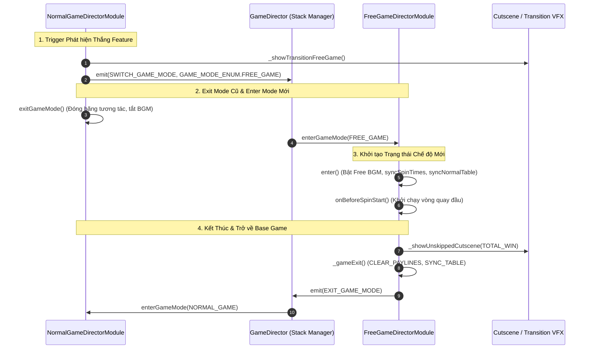

# 🔄 Game Mode Transitions, Stack Management & Lifecycle

---

## 1. Vòng Đời Chuyển Đổi Game Mode (Mode Transition Lifecycle)

Việc chuyển đổi giữa các Game Mode trong `cc-slot-module` tuân theo một quy trình 4 giai đoạn nghiêm ngặt:

---

## 2. Các Điểm Móc Vòng Đời (Lifecycle Hooks)

Mọi `GameModeDirectorModule` đều hỗ trợ các phương thức vòng đời có thể override:

1. **`init(): void`**: Khởi tạo ban đầu khi Node được mount. Tạo `moduleEvent` và gắn vào `moduleList`.
2. **`enter(): void`**: Được gọi khi Mode chính thức nhận quyền điều khiển màn hình. Nơi khởi tạo BGM, cập nhật HUD và dựng bảng quay ban đầu.
3. **`onPreResumeGameMode()` / `onResumeGameMode()`**: Được gọi khi người chơi kết nối lại (reconnect) giữa chừng tính năng.
4. **`exitGameMode(): Promise<void>`**: Được gọi khi Mode sắp bị ẩn đi. Nơi dừng các hoạt họa đang chạy dở.
5. **`resetAllEffectAndTasks(): void`**: Được gọi khi xảy ra lỗi mạng hoặc người chơi bị force-reset về trạng thái Idle.
6. **`onDestroy(): void`**: Giải phóng toàn bộ Event Bus cục bộ (`moduleEvent.destroy()`), dừng các tween đang chạy và gọi `super.onDestroy()`.
