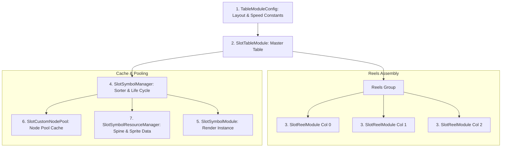

# 🎰 Table Engine: 7 Core Components Cooperation

---

## 1. Sơ Đồ Phối Hợp 7 Hợp Phần Cốt Lõi

Cỗ máy Bảng quay trong `cc-slot-module` được tạo thành từ 7 component chuyên trách:

---

## 2. Bảng Phân Công Nhiệm Vụ 7 Hợp Phần

| STT | Hợp phần | File Nguồn | Trách nhiệm Trọng tâm |
| :---: | :--- | :--- | :--- |
| **1** | `TableModuleConfig` | `TableModuleConfig.ts` | Khai báo số cột/dòng (`TABLE_FORMAT`), tính toán tọa độ `SYMBOL_INDEXES`, và lưu trữ cấu hình tốc độ (`MODES.NORMAL`, `MODES.TURBO`). |
| **2** | `SlotTableModule` | `SlotTableModule.ts` | Lớp vỏ điều phối chính, quản lý mảng `reelList`, phát tín hiệu quay/dừng cột và đồng bộ trạng thái bảng. |
| **3** | `SlotReelModule` | `SlotReelModule.ts` | Điều khiển chuyển động cuộn xoay vô tận của từng cột riêng lẻ, tính toán quán tính và hiệu ứng nảy (Bounce Easing) khi dừng. |
| **4** | `SlotSymbolManager` | `SlotSymbolManager.ts` | Cấp phát, thu hồi, sắp xếp thứ tự đè lớp (`sortSymbols`), quản lý biểu tượng dính (Sticky Wilds) và Z-Index layer. |
| **5** | `SlotSymbolModule` | `SlotSymbolModule.ts` | Component hiển thị của 1 ô Symbol (chứa Sprite tĩnh, Spine Animation, Spine Blur, và các hàm đổi hình `changeToSymbol`). |
| **6** | `SlotCustomNodePool`| `SlotCustomNodePool.ts`| Quản lý Pool Node riêng cho từng loại Symbol ID, tái sử dụng node đã có để triệt tiêu việc cấp phát bộ nhớ rác. |
| **7** | `SlotSymbolResourceManager`| `SlotSymbolResourceManager.ts`| Tải và lưu trữ khung xương Spine SkeletonData, SpriteAtlas toàn bộ biểu tượng game. |
