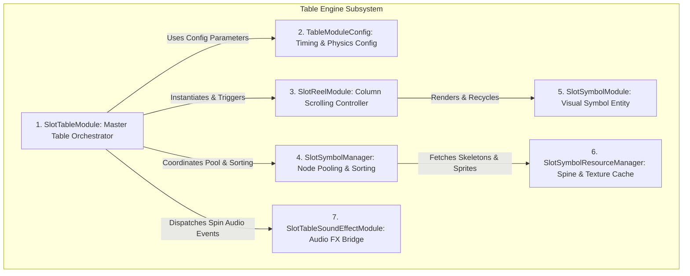
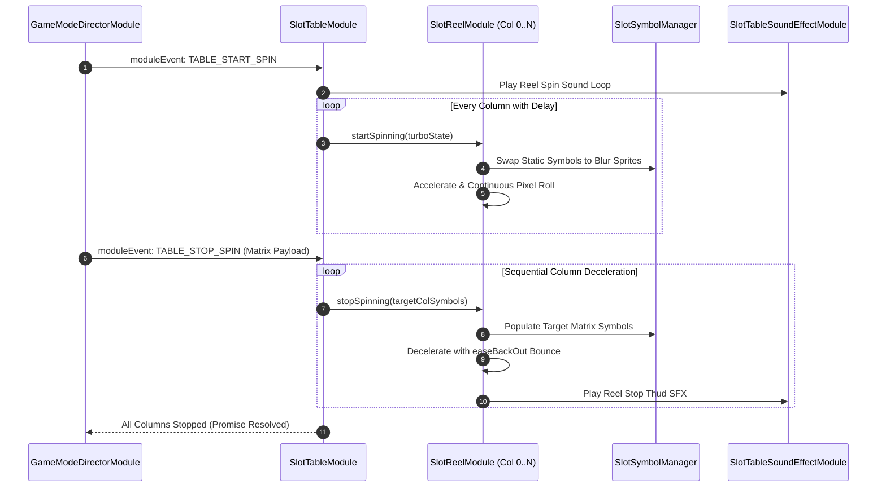

# ⚙️ The 7 Core Components of the Table Engine

---

## 1. Subsystem Architecture Map

The Table Engine is composed of **7 specialized components** working in tight synchronization to deliver smooth 60 FPS slot reel scrolling and Spine animations:

---

## 2. Granular Component Breakdown & Inter-Module Linkage

### 1. `SlotTableModule` (Master Orchestrator)
* **Role**: Root component mounted on `Canvas/Director/GameMode/BoardG/Table`.
* **Linkage**: Receives scoped commands from `GameModeDirectorModule` (`TABLE_START_SPIN`, `TABLE_STOP_SPIN`) via `moduleEvent`. Dispatches column spin actions to child `SlotReelModule` instances and coordinates near-win anticipation teasers.

### 2. `TableModuleConfig` (Timing & Physics Configuration)
* **Role**: Static and dynamic configuration defining reel column counts, row counts, reel spacing, scroll velocities, deceleration easing curves (`easeBackOut`), and sequential column stop delays.
* **Linkage**: Injected into `SlotTableModule` and read by `SlotReelModule` to compute pixel travel distances per frame.

### 3. `SlotReelModule` (Column Scrolling Engine)
* **Role**: Visual controller attached to each individual column (`Reel_0` through `Reel_N`).
* **Linkage**: Manages vertical pixel translation of child symbols, wrapping symbols from bottom to top buffer during continuous spinning, and calculating bounce-landing tweens upon stopping.

### 4. `SlotSymbolManager` (Node Pooling & Z-Index Sorting)
* **Role**: Centralized symbol manager responsible for dynamic node allocation, Spine skeleton playback, and layer sorting.
* **Linkage**: Controls `cc.NodePool` for static and blur symbol instances, recycling off-screen nodes to prevent memory spikes.

### 5. `SlotSymbolModule` (Visual Symbol Entity)
* **Role**: Component attached to every individual symbol node on the grid.
* **Linkage**: Switches visual display modes between **Static Sprite** (idle), **Blur Sprite** (high-speed scroll), and **Spine Skeleton** (winning celebration).

### 6. `SlotSymbolResourceManager` (Asset & Prefab Cache)
* **Role**: Asset cache provider preloading Spine skeleton data, SpriteAtlases, and texture frames.
* **Linkage**: Queried by `SlotSymbolManager` during scene initialization to instantly instantiate symbol visual assets without runtime disk I/O.

### 7. `SlotTableSoundEffectModule` (Audio Synchronization Bridge)
* **Role**: Audio coordinator bridging reel movement to sound playback.
* **Linkage**: Listens to reel stop events to trigger reel stop clicks, scatter anticipation tension tracks, and near-win siren sound effects.

---

## 3. End-to-End Spin Flow Diagram

