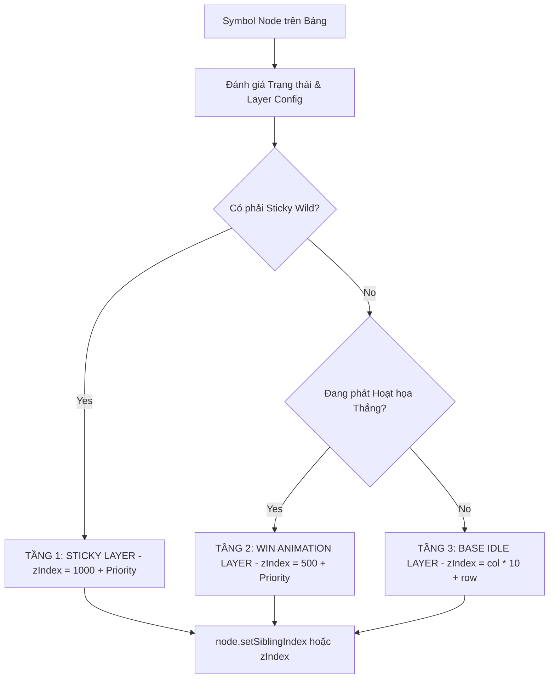

# 📑 Symbol Z-Index Layering & Priority Sorting

---

## 1. Vấn Đề Xung Đột Đè Lớp Biểu Tượng (Visual Overlap Problem)

Khi biểu tượng trúng thưởng phát hoạt họa Spine (thường bung to kích thước, tỏa hiệu ứng hào quang hoặc bay lên khỏi ô cờ), nếu các Node trong Scene Graph giữ nguyên thứ tự DOM mặc định:
* Symbol ở cột bên trái có thể bị cạnh của Symbol cột bên phải đè lên, tạo ra lỗi đồ họa xé rách (visual clipping).
* Biểu tượng dính (Sticky Wild) bị che lấp bởi các Symbol cuộn bình thường.

---

## 2. Thuật Toán Phân Lớp 3 Tầng trong `SlotSymbolManager.sortSymbols()`

`SlotSymbolManager` giải quyết triệt để vấn đề này bằng cách duyệt qua toàn bộ các biểu tượng đang hiển thị và tính toán giá trị `zIndex` theo công thức phân tầng:



### Mã Nguồn Thực Thi Chuẩn:
```typescript
sortSymbols(): void {
    const symbols = this.getShowingSymbols();
    symbols.sort((a, b) => {
        const priorityA = this.getSymbolPriority(a);
        const priorityB = this.getSymbolPriority(b);
        return priorityA - priorityB;
    });

    symbols.forEach((symbol, index) => {
        symbol.node.setSiblingIndex(index);
    });
}
```
