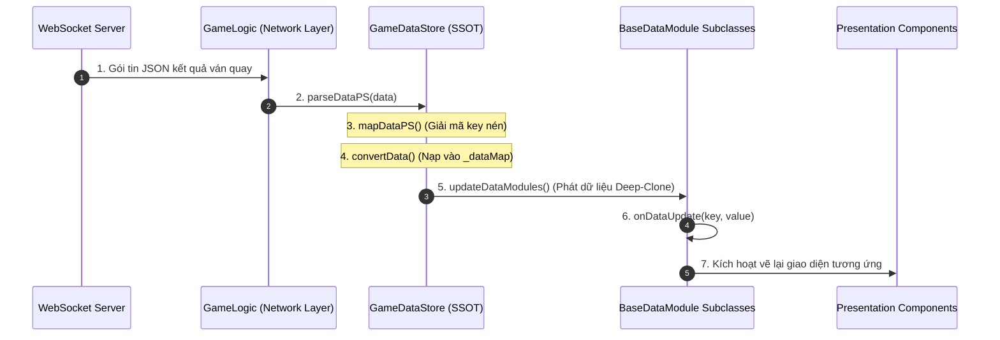

# 🚀 Server Packet Ingestion & Reactive Propagation Pipeline

---

## 1. Dòng Chảy Dữ Liệu Từ Server Đến Giao Diện

---

## 2. Bản Đồ Phân Phối Khóa Dữ Liệu (Data Key Distribution Map)

Mỗi `BaseDataModule` chỉ đăng ký lắng nghe những thuộc tính mà nó cần quản lý:

| Module Data | `registeredKeys` | Thành phần Giao diện Tiêu thụ |
| :--- | :--- | :--- |
| **`SlotTableData`** | `["matrix"]` | `SlotTableModule` (Dựng ma trận biểu tượng) |
| **`SlotTablePaylineData`**| `["payLines", "winAmount"]` | `SlotTablePaylineModule` (Kẻ đường line thắng) |
| **`FreeGameData`** | `["freeGameRemain", "freeGame", "winAmountPS"]` | `FreeGameDirectorModule`, `SpinTimes` HUD |
| **`CascadeModuleData`** | `["cascadeSteps", "cascadeWin"]` | `CascadeModuleDirector` (Hiệu ứng sụp nổ) |
| **`JackpotData`** | `["jackpot"]` | `JackpotModule` (Thanh ticker nhảy số) |
