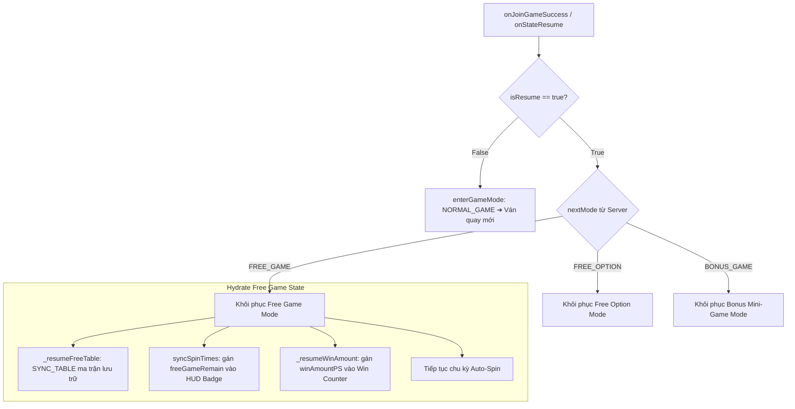

# 🔌 Reconnection Architecture: isResume State Hydration Pipeline

---

## 1. Cơ Chế Bắt Tín Hiệu Reconnection

Khi người chơi tải lại trang web hoặc mạng bị ngắt quãng và kết nối lại, server trả về gói tin chứa cờ:
```typescript
playSession.isResume = true;
```

---

## 2. Quy Trình Khôi Phục Trạng Thái (State Hydration Pipeline)



### 3 Điểm Cốt Lõi Khi Xử Lý Reconnection:
1. **Dựng lại Bảng quay (`_resumeFreeTable` / `_resumeNormalTable`)**: Bắn `moduleEvent.emit("SYNC_TABLE")` để các cột hiển thị ngay ma trận cuối cùng trước khi mất mạng mà không quay lại từ đầu.
2. **Khôi phục Bộ đếm Số vòng (`syncSpinTimes`)**: Đọc `freeGameRemain` để hiển thị chính xác số lượt quay còn lại (tránh gán nhầm tổng số ban đầu `freeGame`).
3. **Khôi phục Tiền thắng Lũy kế (`_resumeWinAmount`)**: Cập nhật `winAmountPS` lên nhãn Win Amount để người chơi theo dõi tiếp tục tổng thắng của các vòng trước đó.
