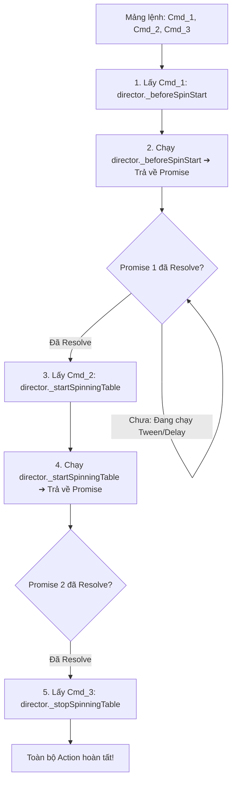

# 🔗 Async Promise Chaining Mechanism in ScriptExecutor

---

## 1. Bản Chất Hoạt Động của Cỗ Máy `ScriptExecutor`

`ScriptExecutor` biến đổi danh sách lệnh thành chuỗi `async / await` tuần tự mà không gây nghẽn (non-blocking) luồng chính của Cocos Creator:



---

## 2. Mã Nguồn Cốt Lõi (Core Implementation)

```typescript
export class ScriptExecutor {
    async executeCommands(commands: Array<string | any>, target: any): Promise<void> {
        for (const item of commands) {
            let funcName = "";
            let args = null;

            if (typeof item === "string") {
                funcName = item;
            } else if (typeof item === "object" && item.command) {
                funcName = item.command;
                args = item.data;
            }

            if (target && typeof target[funcName] === "function") {
                // Đảm bảo method luôn được await dù trả về Promise hay void
                await target[funcName](args);
            }
        }
    }
}
```
Nhờ cơ chế này, mọi hành vi diễn hoạt đồ họa phức tạp nhất (chờ cột dừng 1.5s, chờ đếm tiền 4s, chờ popup đóng) đều được xâu chuỗi gọn gàng, chuẩn xác từng mili-giây.
