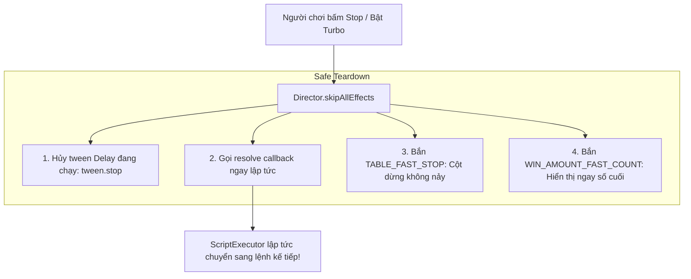

# ⚡ Turbo Mode & Safe Fast-Forward with skipAllEffects

---

## 1. Cơ Chế Bỏ Qua Diễn Hoạt An Toàn (Safe Skip Architecture)

Khi người chơi bấm nút **Stop** nhanh hoặc đang bật chế độ **Turbo Spin**:
* Cột quay phải dừng ngay lập tức.
* Các khoảng chờ thời gian (`delayAction`, `_delayTimeScript`) phải bị ngắt ngay lập tức mà không làm treo hàng đợi `ScriptExecutor`.



---

## 2. Kỹ Thuật Viết Hàm Delay Có Thể Bị Hủy An Toàn

```typescript
// Trong GameModeDirectorModule.ts
delayAction(time: number = 0): Promise<void> {
    if (time <= 0) {
        return Promise.resolve();
    }
    return new Promise((resolve) => {
        // Lưu trữ callback để skipAllEffects() có thể gọi trực tiếp
        this._delayActionCB = () => {
            this._delayActionCB = null;
            resolve();
        };

        this.scheduleOnce(this._delayActionCB, time);
    });
}

clearDelayAction(): void {
    if (this._delayActionCB) {
        this.unschedule(this._delayActionCB);
        const cb = this._delayActionCB;
        this._delayActionCB = null;
        cb(); // Resolve Promise ngay lập tức
    }
}
```
Kỹ thuật này đảm bảo Promise không bao giờ bị "treo vĩnh viễn" (unresolved promise leak), giúp game chuyển cảnh siêu tốc mà không bao giờ bị đơ giao diện.
