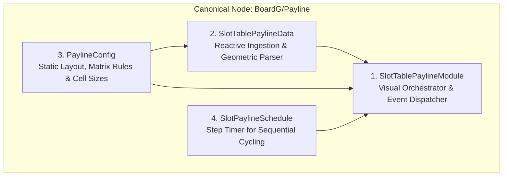
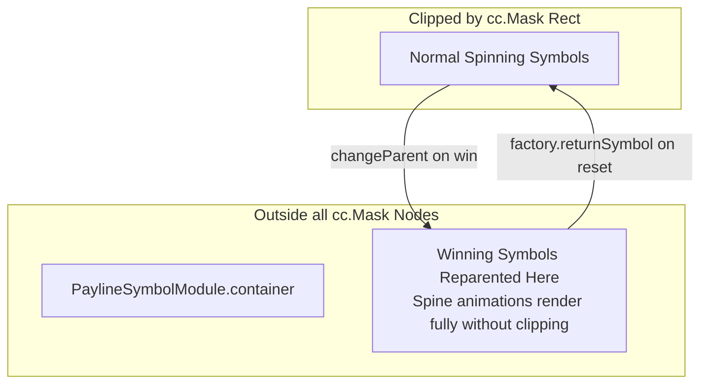

# 🧩 Payline Component Quad & Visual Rendering Layers

---

## 1. The Payline Component Quad

The Payline subsystem operates through 4 tightly coupled components mounted on the canonical `Canvas/.../BoardG/Payline` node:



| Component | Base Class | Architectural Role |
| :--- | :--- | :--- |
| **`SlotTablePaylineModule`** | `SlotBaseModule` | Master coordinator; creates internal `payLineEmitter` and routes Director events. |
| **`SlotTablePaylineData`** | `BaseDataModule` | Converts raw server strings into `winSymbols` coordinates according to `PAYLINE_TYPE`. |
| **`PaylineConfig`** | `cc.Component` | Declares `PAYLINE_TYPE`, `TABLE_CONFIG`, `cellSize`, and `PAY_LINE_MATRIX`. |
| **`SlotPaylineSchedule`** | `BasePaylineComponent` | Manages timing intervals for cycling through individual hit lines during idle states. |

---

## 2. The 4 Visual Rendering Layers

Below the `Payline` node, visual presentation is split into 4 independent child layers:

```text
Canvas/Director/GameMode/BoardG/Payline
├── WinSymbolsLayer (PaylineSymbolModule)       [Layer 1: Symbol Win Animations & Dimming]
├── WinFramesLayer (PaylineWinFrameModule)        [Layer 2: Glowing Border Boxes]
├── LineDrawingLayer (PaylineLineModule)          [Layer 3: Vector Connecting Lines]
└── LineNumberLayer (PaylineNumberModule)         [Layer 4: Border Payline Numbers]
```

### Layer 1: `PaylineSymbolModule` (Symbol Animation Layer)
- **Role**: Pulls winning `SlotSymbolModule` nodes from `SlotSymbolManager`, reparents them to a top-level container, and executes `PLAY_ANIMATION_WIN`.
- **Dimming**: When single lines are isolated, unhit symbols receive `SHOW_STATIC` and `DISABLE_HIGHLIGHT`.

### Layer 2: `PaylineWinFrameModule` (Border Box Layer)
- **Role**: Uses an internal `cc.NodePool("PaylineWinFrame")` to spawn animated neon/gold border boxes around each winning symbol coordinate.
- **Coordination**: Listens to `SYMBOL_PLAY_ANIMATION_WIN` emitted by `PaylineSymbolModule`.

### Layer 3: `PaylineLineModule` (Line Drawing Layer)
- **Role**: Uses Cocos Creator `cc.Graphics` or segmented sprite prefabs to render the geometric path connecting winning symbols from column to column.
- **Config**: Reads coordinate vertices calculated by `PaylineUtils`.

### Layer 4: `PaylineNumberModule` (Side Index Number Layer)
- **Role**: Illuminates number labels (1 through 50) located on the left and right gutters of the slot cabinet when the corresponding line hits.

---

## 3. Z-Index Management & Mask Clipping Protection

A common slot development bug occurs when large Spine character symbols are clipped by the rectangular mask of their reel column.



1. **Reparenting Strategy**: When a symbol wins, `eno.changeParent(symbol, this.container)` transfers it to the `Payline` layer which sits above all column mask components.
2. **Sibling Re-sorting**: `SlotSymbolManager.updateSymbolSiblingIndex()` re-orders child nodes so that higher-paying symbols or Wilds always render in front of standard symbols.
3. **Safe Return**: On `PAYLINE_CLEAR`, symbols are reparented back to their column parent or returned cleanly to the pool.
