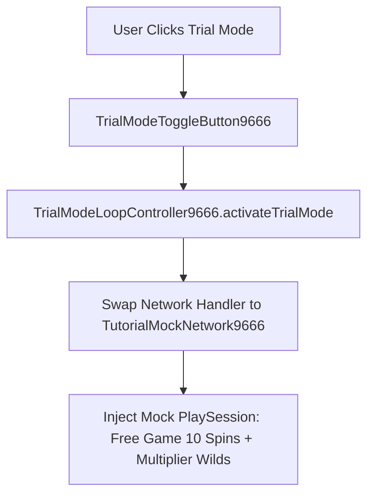

# 🎮 Red Cliff (g9666) Trial Mode & UI Framework

---

## 1. Trial Mode Architecture & Mock Network Ingestion

Trial Mode in Red Cliff allows players to experience full Free Game feature loops and High-Win scenarios using pre-scripted mock networks:
- **`TrialModeLoopController9666`**: Controls trial spin transitions and loops back to Normal Game upon feature completion.
- **`TrialModeToggleButton9666`**: Toggles mock mode in debug builds.
- **`TutorialMockNetwork9666`** & **`TutorialMockData9666`**: Injects scripted server responses for Free Spin triggers, Stack Wilds, and Big Wins.

---

## 2. UI Manager & Responsive Layout (`UIManagerModule9666`)

Controls adaptive UI scaling across device aspect ratios (16:9, 18:9, 4:3) and popup dialog management (Bet History, Win Limits, Paytables).
