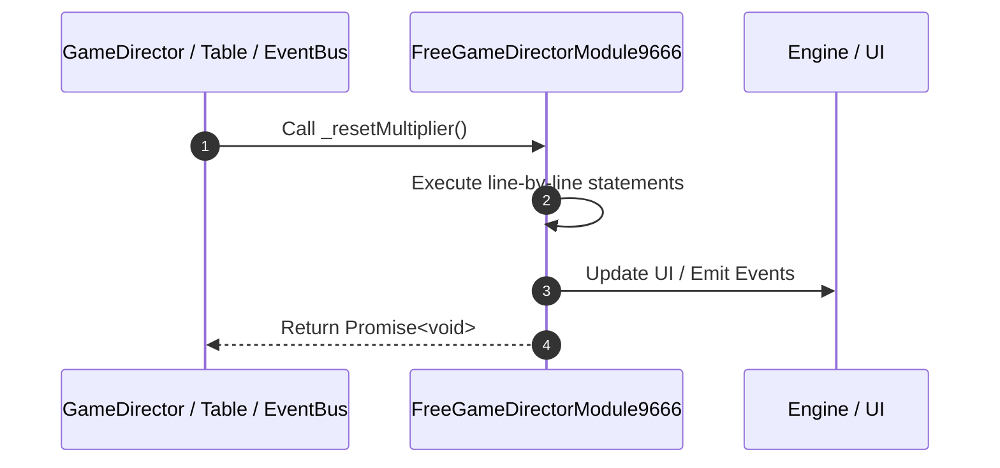

# 📖 `FreeGameDirectorModule9666._resetMultiplier()`

---

## 1. Method Signature & Overview

```typescript
public _resetMultiplier(): Promise<void>
```

- **Declaring Class**: `FreeGameDirectorModule9666` ([`FreeGameDirectorModule9666.ts`](file:///C:/Users/ADMIN/lamnino/cc20-new-all-in-one/assets/cc-release-slot/cc1-red-cliff/scripts/GameMode/FreeGameDirectorModule9666.ts))
- **Source Range**: Lines 38 to 40
- **Execution Cost**: $O(1)$ synchronous logic or timer Promise.

---

## 2. Complete Source Implementation

```typescript
	_resetMultiplier(): Promise<void> {
		return this.eventManager.emit("RESET_MULTIPLIER", true);
	}
```

---

## 3. Line-by-Line Code Breakdown

| Line # | Code Snippet | Technical Analysis & Engine Behavior |
| :---: | :--- | :--- |
| **38** | `_resetMultiplier(): Promise<void> {` | Method entry signature declaring `_resetMultiplier()` returning `Promise<void>`. |
| **39** | `return this.eventManager.emit("RESET_MULTIPLIER", true);` | Returns value or promise to calling sequence. |
| **40** | `}` | Scope boundary closing block. |

---

## 4. Execution Call Graph & Sequence


