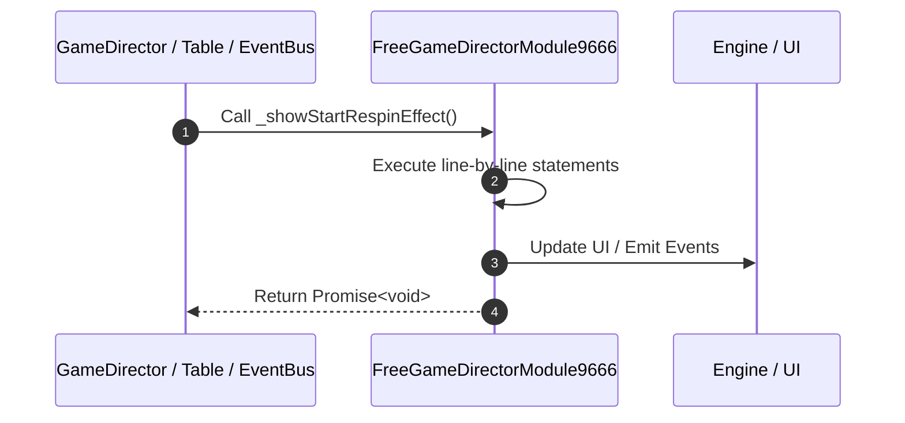

# 📖 `FreeGameDirectorModule9666._showStartRespinEffect()`

---

## 1. Method Signature & Overview

```typescript
public _showStartRespinEffect(): Promise<void>
```

- **Declaring Class**: `FreeGameDirectorModule9666` ([`FreeGameDirectorModule9666.ts`](file:///C:/Users/ADMIN/lamnino/cc20-new-all-in-one/assets/cc-release-slot/cc1-red-cliff/scripts/GameMode/FreeGameDirectorModule9666.ts))
- **Source Range**: Lines 90 to 105
- **Execution Cost**: $O(1)$ synchronous logic or timer Promise.

---

## 2. Complete Source Implementation

```typescript
	async _showStartRespinEffect(): Promise<void> {
		if (this.dataStore.playSession.payLines
			|| this.dataStore.playSession.freeGamePayLines
			|| this.dataStore.playSession.normalGamePayLines) {
			this._blinkAllPaylines();

			this._showPaylineAmount();
			const speed = (this.gameSettings.isFastToResult || this.gameSettings.isTurboActive) ? 2 : 1;
			await this.delayAction(1 / speed);
			await this.eventManager.emit("APPLY_MULTIPLIER_TO_WIN_AMOUNT", this.dataStore.playSession.respinGameTotal === 1);
			// await this.eventManager.emit('ON_HIDE_PAYLINE_INFO');
			this.eventManager.emit(COMMIT_RESPIN_WIN_AMOUNT);
			await this._clearPaylines();
		}
		return Promise.resolve();
	}
```

---

## 3. Line-by-Line Code Breakdown

| Line # | Code Snippet | Technical Analysis & Engine Behavior |
| :---: | :--- | :--- |
| **90** | `async _showStartRespinEffect(): Promise<void> {` | Method entry signature declaring `_showStartRespinEffect()` returning `Promise<void>`. |
| **91** | `if (this.dataStore.playSession.payLines` | Conditional guard evaluating branching prerequisite. |
| **92** | `\|\| this.dataStore.playSession.freeGamePayLines` | Executes core logic. |
| **93** | `\|\| this.dataStore.playSession.normalGamePayLines) {` | Executes core logic. |
| **94** | `this._blinkAllPaylines();` | Executes core logic. |
| **95** | `` | Executes core logic. |
| **96** | `this._showPaylineAmount();` | Executes core logic. |
| **97** | `const speed = (this.gameSettings.isFastToResult \|\| this.gameSettings.isTurboActive) ? 2 : 1;` | Allocates local variable `speed`. |
| **98** | `await this.delayAction(1 / speed);` | Executes core logic. |
| **99** | `await this.eventManager.emit("APPLY_MULTIPLIER_TO_WIN_AMOUNT", this.dataStore.playSession.respinGameTotal === 1);` | Dispatches event `APPLY_MULTIPLIER_TO_WIN_AMOUNT` to subscribers. |
| **100** | `// await this.eventManager.emit('ON_HIDE_PAYLINE_INFO');` | Dispatches event `ON_HIDE_PAYLINE_INFO` to subscribers. |
| **101** | `this.eventManager.emit(COMMIT_RESPIN_WIN_AMOUNT);` | Dispatches event `Event` to subscribers. |
| **102** | `await this._clearPaylines();` | Executes core logic. |
| **103** | `}` | Scope boundary closing block. |
| **104** | `return Promise.resolve();` | Returns value or promise to calling sequence. |
| **105** | `}` | Scope boundary closing block. |

---

## 4. Execution Call Graph & Sequence


