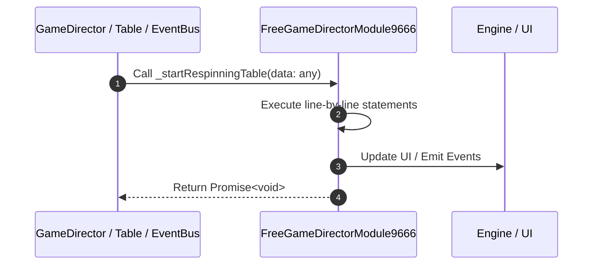

# 📖 `FreeGameDirectorModule9666._startRespinningTable()`

---

## 1. Method Signature & Overview

```typescript
public _startRespinningTable(data: any): Promise<void>
```

- **Declaring Class**: `FreeGameDirectorModule9666` ([`FreeGameDirectorModule9666.ts`](file:///C:/Users/ADMIN/lamnino/cc20-new-all-in-one/assets/cc-release-slot/cc1-red-cliff/scripts/GameMode/FreeGameDirectorModule9666.ts))
- **Source Range**: Lines 50 to 55
- **Execution Cost**: $O(1)$ synchronous logic or timer Promise.

---

## 2. Complete Source Implementation

```typescript
	override async _startRespinningTable(data: any): Promise<void> {
		await Promise.all([
			this.moduleEvent.emit("TABLE_START_RESPIN", data),
			this._collectScatter(),
		]);
	}
```

---

## 3. Line-by-Line Code Breakdown

| Line # | Code Snippet | Technical Analysis & Engine Behavior |
| :---: | :--- | :--- |
| **50** | `override async _startRespinningTable(data: any): Promise<void> {` | Method entry signature declaring `_startRespinningTable(data: any)` returning `Promise<void>`. |
| **51** | `await Promise.all([` | Executes core logic. |
| **52** | `this.moduleEvent.emit("TABLE_START_RESPIN", data),` | Dispatches event `TABLE_START_RESPIN` to subscribers. |
| **53** | `this._collectScatter(),` | Executes core logic. |
| **54** | `]);` | Executes core logic. |
| **55** | `}` | Scope boundary closing block. |

---

## 4. Execution Call Graph & Sequence


