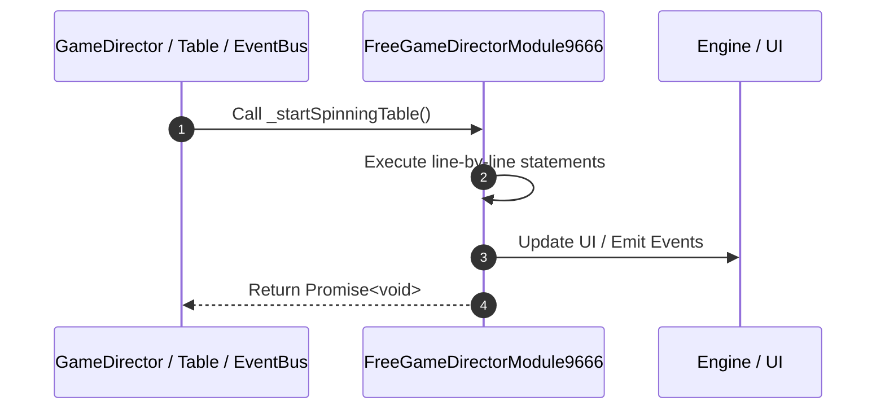

# 📖 `FreeGameDirectorModule9666._startSpinningTable()`

---

## 1. Method Signature & Overview

```typescript
public _startSpinningTable(): Promise<void>
```

- **Declaring Class**: `FreeGameDirectorModule9666` ([`FreeGameDirectorModule9666.ts`](file:///C:/Users/ADMIN/lamnino/cc20-new-all-in-one/assets/cc-release-slot/cc1-red-cliff/scripts/GameMode/FreeGameDirectorModule9666.ts))
- **Source Range**: Lines 115 to 118
- **Execution Cost**: $O(1)$ synchronous logic or timer Promise.

---

## 2. Complete Source Implementation

```typescript
	override async _startSpinningTable(): Promise<void> {
		await this.moduleEvent.emit("RESET_MEGAWAY");
		return super._startSpinningTable();
	}
```

---

## 3. Line-by-Line Code Breakdown

| Line # | Code Snippet | Technical Analysis & Engine Behavior |
| :---: | :--- | :--- |
| **115** | `override async _startSpinningTable(): Promise<void> {` | Method entry signature declaring `_startSpinningTable()` returning `Promise<void>`. |
| **116** | `await this.moduleEvent.emit("RESET_MEGAWAY");` | Dispatches event `RESET_MEGAWAY` to subscribers. |
| **117** | `return super._startSpinningTable();` | Returns value or promise to calling sequence. |
| **118** | `}` | Scope boundary closing block. |

---

## 4. Execution Call Graph & Sequence


