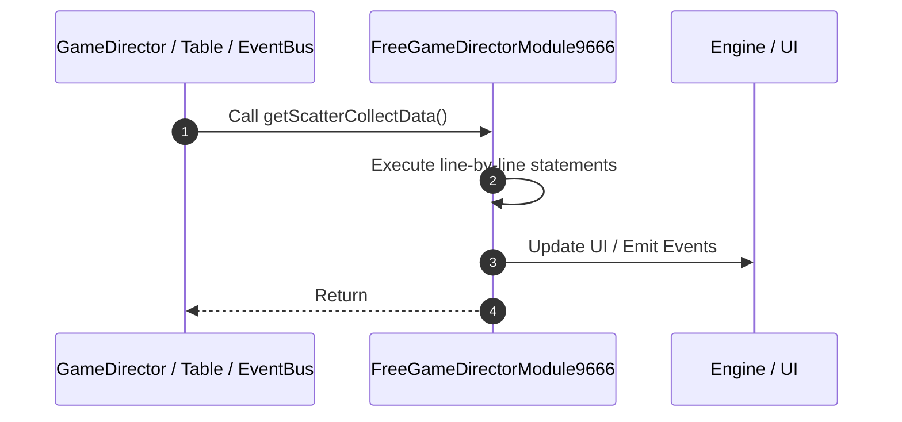

# 📖 `FreeGameDirectorModule9666.getScatterCollectData()`

---

## 1. Method Signature & Overview

```typescript
public getScatterCollectData(): 
```

- **Declaring Class**: `FreeGameDirectorModule9666` ([`FreeGameDirectorModule9666.ts`](file:///C:/Users/ADMIN/lamnino/cc20-new-all-in-one/assets/cc-release-slot/cc1-red-cliff/scripts/GameMode/FreeGameDirectorModule9666.ts))
- **Source Range**: Lines 57 to 70
- **Execution Cost**: $O(1)$ synchronous logic or timer Promise.

---

## 2. Complete Source Implementation

```typescript
	private getScatterCollectData(): { count: number, matrixIndexes: number[], formatMatrix: string[] } {
		const SCATTER_SYMBOL = 'A';
		const rawMatrix: string[] = this.dataStore.playSession.respinGameMatrix || this.dataStore.playSession.matrix || [];
		const formatMatrix: string[] = this.dataStore.playSession.freeFormatMatrix || this.dataStore.playSession.formatMatrix || [];

		const matrixIndexes: number[] = [];
		rawMatrix.forEach((symbol, index) => {
			if (symbol === SCATTER_SYMBOL) {
				matrixIndexes.push(index);
			}
		});

		return { count: matrixIndexes.length, matrixIndexes, formatMatrix };
	}
```

---

## 3. Line-by-Line Code Breakdown

| Line # | Code Snippet | Technical Analysis & Engine Behavior |
| :---: | :--- | :--- |
| **57** | `private getScatterCollectData(): { count: number, matrixIndexes: number[], formatMatrix: string[] } {` | Method entry signature declaring `getScatterCollectData()` returning ``. |
| **58** | `const SCATTER_SYMBOL = 'A';` | Allocates local variable `SCATTER_SYMBOL`. |
| **59** | `const rawMatrix: string[] = this.dataStore.playSession.respinGameMatrix \|\| this.dataStore.playSession.matrix \|\| [];` | Allocates local variable `rawMatrix: string[]`. |
| **60** | `const formatMatrix: string[] = this.dataStore.playSession.freeFormatMatrix \|\| this.dataStore.playSession.formatMatrix \|\| [];` | Allocates local variable `formatMatrix: string[]`. |
| **61** | `` | Executes core logic. |
| **62** | `const matrixIndexes: number[] = [];` | Allocates local variable `matrixIndexes: number[]`. |
| **63** | `rawMatrix.forEach((symbol, index) => {` | Executes core logic. |
| **64** | `if (symbol === SCATTER_SYMBOL) {` | Conditional guard evaluating branching prerequisite. |
| **65** | `matrixIndexes.push(index);` | Executes core logic. |
| **66** | `}` | Scope boundary closing block. |
| **67** | `});` | Executes core logic. |
| **68** | `` | Executes core logic. |
| **69** | `return { count: matrixIndexes.length, matrixIndexes, formatMatrix };` | Returns value or promise to calling sequence. |
| **70** | `}` | Scope boundary closing block. |

---

## 4. Execution Call Graph & Sequence


