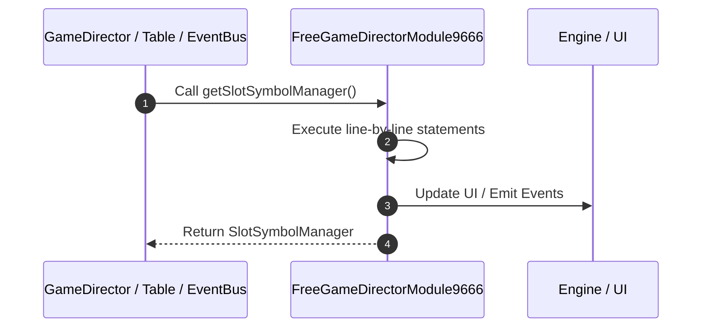

# 📖 `FreeGameDirectorModule9666.getSlotSymbolManager()`

---

## 1. Method Signature & Overview

```typescript
public getSlotSymbolManager(): SlotSymbolManager
```

- **Declaring Class**: `FreeGameDirectorModule9666` ([`FreeGameDirectorModule9666.ts`](file:///C:/Users/ADMIN/lamnino/cc20-new-all-in-one/assets/cc-release-slot/cc1-red-cliff/scripts/GameMode/FreeGameDirectorModule9666.ts))
- **Source Range**: Lines 148 to 156
- **Execution Cost**: $O(1)$ synchronous logic or timer Promise.

---

## 2. Complete Source Implementation

```typescript
	protected getSlotSymbolManager(): SlotSymbolManager {
		for (const m of this.moduleList) {
			const slotModule = m.getComponent(SlotSymbolManager);
			if (slotModule) {
				return slotModule;
			}
		}
		return null;
	}
```

---

## 3. Line-by-Line Code Breakdown

| Line # | Code Snippet | Technical Analysis & Engine Behavior |
| :---: | :--- | :--- |
| **148** | `protected getSlotSymbolManager(): SlotSymbolManager {` | Method entry signature declaring `getSlotSymbolManager()` returning `SlotSymbolManager`. |
| **149** | `for (const m of this.moduleList) {` | Executes core logic. |
| **150** | `const slotModule = m.getComponent(SlotSymbolManager);` | Allocates local variable `slotModule`. |
| **151** | `if (slotModule) {` | Conditional guard evaluating branching prerequisite. |
| **152** | `return slotModule;` | Returns value or promise to calling sequence. |
| **153** | `}` | Scope boundary closing block. |
| **154** | `}` | Scope boundary closing block. |
| **155** | `return null;` | Returns value or promise to calling sequence. |
| **156** | `}` | Scope boundary closing block. |

---

## 4. Execution Call Graph & Sequence


