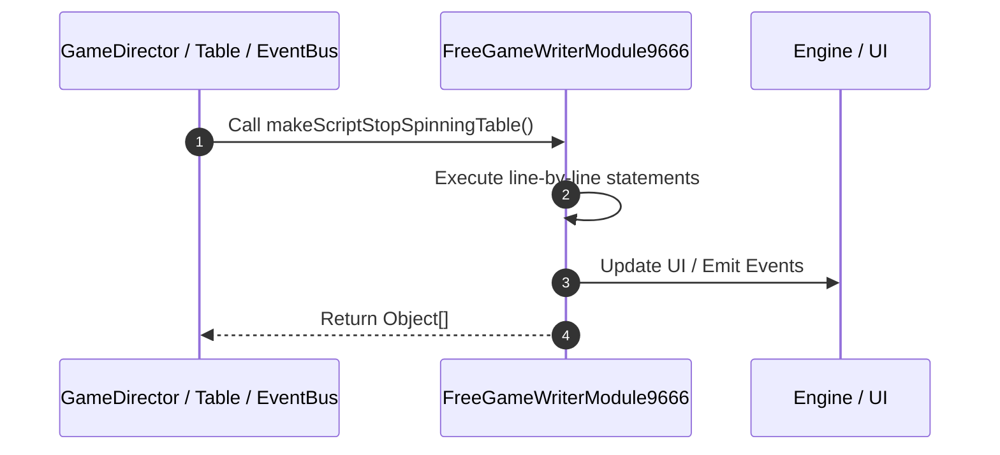

# 📖 `FreeGameWriterModule9666.makeScriptStopSpinningTable()`

---

## 1. Method Signature & Overview

```typescript
public makeScriptStopSpinningTable(): Object[]
```

- **Declaring Class**: `FreeGameWriterModule9666` ([`FreeGameWriterModule9666.ts`](file:///C:/Users/ADMIN/lamnino/cc20-new-all-in-one/assets/cc-release-slot/cc1-red-cliff/scripts/GameMode/FreeGameWriterModule9666.ts))
- **Source Range**: Lines 53 to 74
- **Execution Cost**: $O(1)$ synchronous logic or timer Promise.

---

## 2. Complete Source Implementation

```typescript
	makeScriptStopSpinningTable(): Object[] {
		let listScript = [];
		listScript.push({
			command: "_stopSpinningTopTable",
		});
		listScript.push({
			command: "_stopSpinningTable",
		});
		listScript.push({
			command: "_syncStackWild",
		});
		listScript.push({
			command: "_collectWildMultiplier",
		});
		listScript.push({
			command: "_setUpPaylines",
		});
		listScript.push({
			command: "_syncJackpotCollection",
		});
		return listScript;
	}
```

---

## 3. Line-by-Line Code Breakdown

| Line # | Code Snippet | Technical Analysis & Engine Behavior |
| :---: | :--- | :--- |
| **53** | `makeScriptStopSpinningTable(): Object[] {` | Method entry signature declaring `makeScriptStopSpinningTable()` returning `Object[]`. |
| **54** | `let listScript = [];` | Allocates local variable `listScript`. |
| **55** | `listScript.push({` | Executes core logic. |
| **56** | `command: "_stopSpinningTopTable",` | Executes core logic. |
| **57** | `});` | Executes core logic. |
| **58** | `listScript.push({` | Executes core logic. |
| **59** | `command: "_stopSpinningTable",` | Executes core logic. |
| **60** | `});` | Executes core logic. |
| **61** | `listScript.push({` | Executes core logic. |
| **62** | `command: "_syncStackWild",` | Executes core logic. |
| **63** | `});` | Executes core logic. |
| **64** | `listScript.push({` | Executes core logic. |
| **65** | `command: "_collectWildMultiplier",` | Executes core logic. |
| **66** | `});` | Executes core logic. |
| **67** | `listScript.push({` | Executes core logic. |
| **68** | `command: "_setUpPaylines",` | Executes core logic. |
| **69** | `});` | Executes core logic. |
| **70** | `listScript.push({` | Executes core logic. |
| **71** | `command: "_syncJackpotCollection",` | Executes core logic. |
| **72** | `});` | Executes core logic. |
| **73** | `return listScript;` | Returns value or promise to calling sequence. |
| **74** | `}` | Scope boundary closing block. |

---

## 4. Execution Call Graph & Sequence


