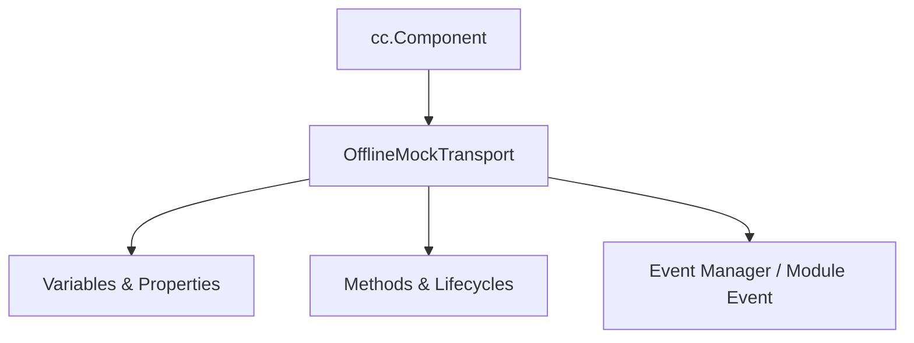

# 🏛️ `OfflineMockTransport` Architecture & Role Specification

- **Source File**: [`OfflineMockTransport.ts`](file:///C:/Users/ADMIN/lamnino/cc20-new-all-in-one/assets/cc-release-slot/cc1-red-cliff/scripts/Mock/Framework/OfflineMockTransport.ts)
- **Class Hierarchy**: `OfflineMockTransport` ➔ `cc.Component`
- **Game ID**: `g9666` / `9666` (Red Cliff - Đại Chiến Xích Bích)

---

## 1. Architectural Mission

`OfflineMockTransport` is a specialized runtime component in the **Red Cliff (g9666)** slot engine.

---

## 2. Core Responsibilities

1. **State & Lifecycle Management**:
   - Maintains 4 declared properties and variables with precise state transitions.
2. **Execution & Event Handling**:
   - Implements 10 custom and overridden methods interacting with Cocos Creator 2.4 and ARK Slot SDK.
