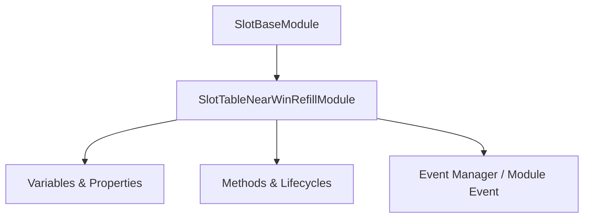

# 🏛️ `SlotTableNearWinRefillModule` Architecture & Role Specification

- **Source File**: [`SlotTableNearWinRefillModule.ts`](file:///C:/Users/ADMIN/lamnino/cc20-new-all-in-one/assets/cc-release-slot/cc1-red-cliff/scripts/Table/SlotTableNearWinRefillModule.ts)
- **Class Hierarchy**: `SlotTableNearWinRefillModule` ➔ `SlotBaseModule`
- **Game ID**: `g9666` / `9666` (Red Cliff - Đại Chiến Xích Bích)

---

## 1. Architectural Mission

`SlotTableNearWinRefillModule` is a specialized runtime component in the **Red Cliff (g9666)** slot engine.

---

## 2. Core Responsibilities

1. **State & Lifecycle Management**:
   - Maintains 27 declared properties and variables with precise state transitions.
2. **Execution & Event Handling**:
   - Implements 0 custom and overridden methods interacting with Cocos Creator 2.4 and ARK Slot SDK.
