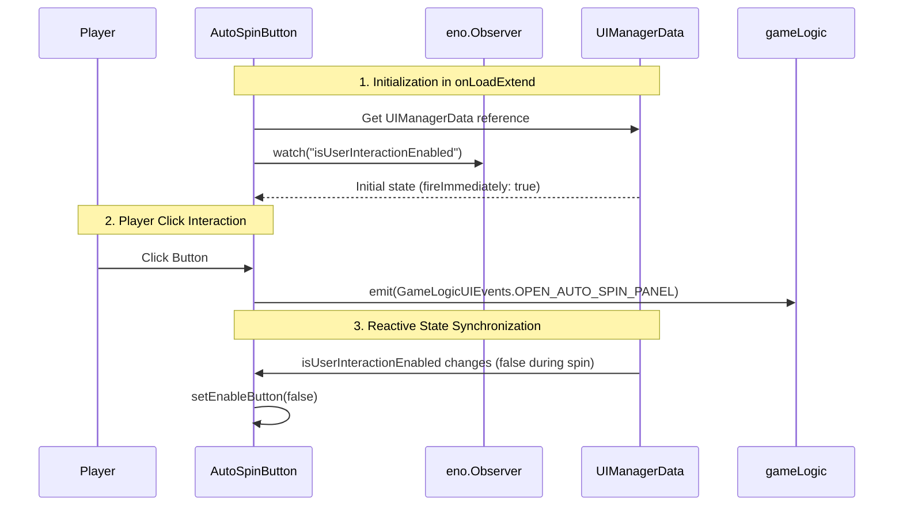

# AutoSpinButton: Overview & Architecture

> **Source Path**: `assets/cc-common/cc-slot-module/GUI/AutoSpin/AutoSpinButton.ts`  
> **Inheritance**: `AutoSpinButton` ➔ `SlotBaseModule` ➔ `cc.Component`  
> **Online Reference**: [AutoSpinButton on Enotion Platform](https://slot-platform.enostd.gay/api-references/slot-module/gui/auto-spin-panel.html)

---

## 1. Purpose & Architectural Role
`AutoSpinButton` is the GUI control component responsible for:
* Opening the Auto-Spin configuration popup dialog (`OPEN_AUTO_SPIN_PANEL`).
* Reactively listening to `UIManagerData.isUserInteractionEnabled` via the `eno.Observer` system to automatically enable or disable button interactability during active spin cycles and win animations.

---

## 2. Interaction & Observer Flow

