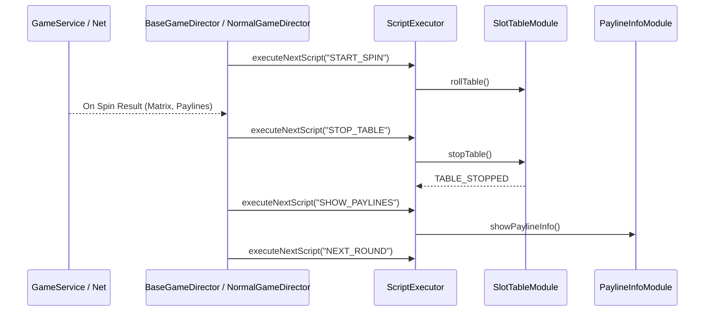

# BaseGameDirector: Overview & Architecture

> **Source Path**: `assets/cc-common/cc-slot-module/GameMode/Core/BaseGameDirector.ts`  
> **Inheritance**: `BaseGameDirector` ➔ `SlotBaseModule` ➔ `cc.Component`  
> **Online Reference**: [Game Mode & Directors on Enotion Platform](https://slot-platform.enostd.gay/api-references/slot-module/game-mode/)

---

## 1. Purpose & Architectural Role
`BaseGameDirector` is the **state machine orchestrator** driving game mode execution sequences:
* Manages the lifecycle of game rounds via `ScriptExecutor`: executing sequential or parallel async script tasks (`runAction`, `executeNextScript`).
* Handles step transitions: Spin Start ➔ Matrix Receive ➔ Table Stop ➔ Near-Win Presentation ➔ Payline Blink ➔ Multiplier Calculation ➔ Win Dialog ➔ Mode Switch (Free Spins / Bonus).
* Supports instant game speed modification (`setGameSpeed` for Turbo / Fast Play).

---

## 2. Director Script Execution Flow

