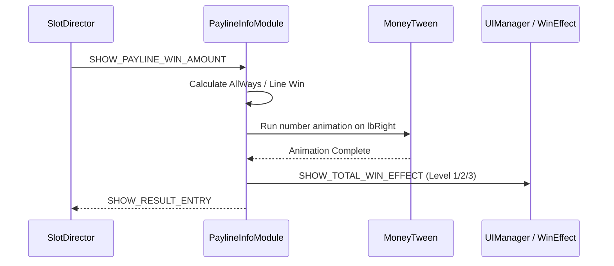

# PaylineInfoModule: Overview & Architecture

> **Source Path**: `assets/cc-common/cc-slot-module/GUI/PaylineInfo/PaylineInfoModule.ts`  
> **Inheritance**: `PaylineInfoModule` ➔ `SlotBaseModule` ➔ `cc.Component`  
> **Online Reference**: [PaylineInfo on Enotion Platform](https://slot-platform.enostd.gay/api-references/slot-module/gui/payline-info.html)

---

## 1. Purpose & Architectural Role
`PaylineInfoModule` controls the **bottom win presentation bar**, responsible for:
* Displaying individual winning lines with symbol icons and line payouts.
* Presenting total accumulated round wins with rolling `MoneyTween` animations.
* Synchronizing win impact animations with `SHOW_TOTAL_WIN_EFFECT` (Level 1, 2, 3 frames).

---

## 2. Presentation Flow

