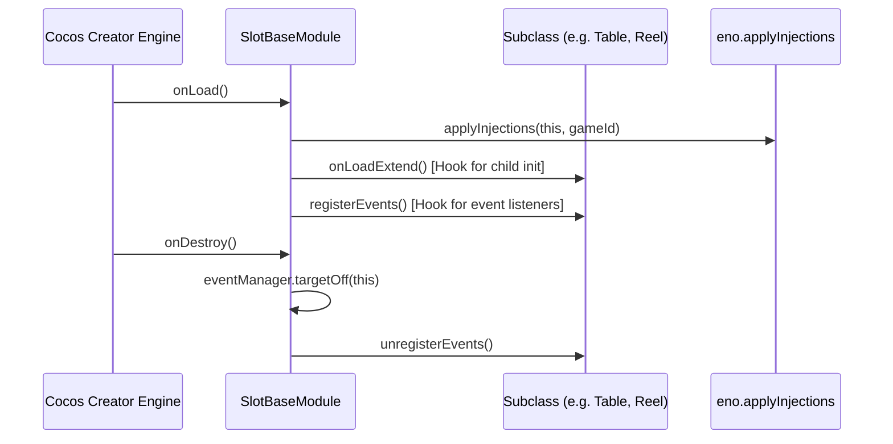

# SlotBaseModule: Overview & Architecture

> **Source Path**: `assets/cc-common/cc-slot-module/Core/SlotBaseModule.ts`  
> **Inheritance**: `SlotBaseModule` ➔ `cc.Component`  
> **Online Reference**: [SlotBaseModule on Enotion Platform](https://slot-platform.enostd.gay/api-references/slot-module/slot-base-module.html)

---

## 1. Purpose & Architectural Role
`SlotBaseModule` is the **fundamental base class** for all slot game components in the `cc-common` framework.
It standardizes:
* **Dependency Injection**: Automatically injects global singletons (`gameLogic`, `eventManager`, `observer`, `soundPlayer`).
* **Game Mode Management**: Binds each module instance to its active game mode (`NORMAL_GAME`, `FREE_GAME`, `BONUS_GAME`).
* **Event Scoping**: Provides isolated module events (`this.moduleEvent`) and global bus events (`this.eventManager`).

---

## 2. Bootstrap & Lifecycle Hooks

