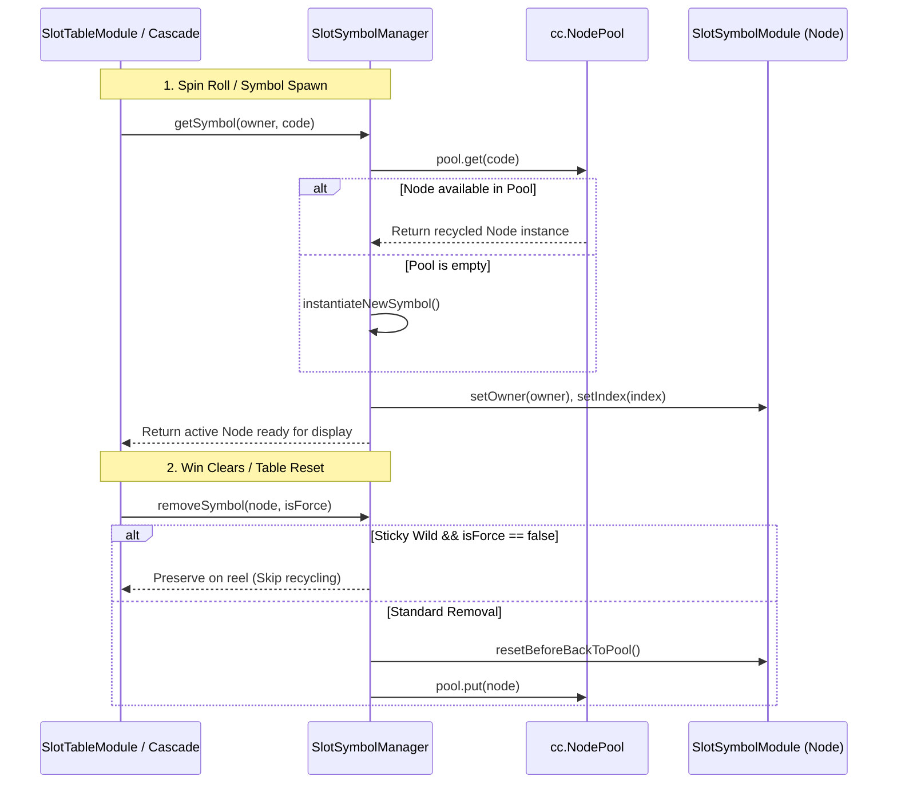

# SlotSymbolManager: Overview & Architecture

> **Source Path**: `assets/cc-common/cc-slot-module/BaseModule/Table/SlotSymbol/SlotSymbolManager.ts`  
> **Inheritance**: `SlotSymbolManager` ➔ `SlotBaseModule` ➔ `cc.Component`

---

## 1. Architectural Role & Purpose

`SlotSymbolManager` is the **Lifecycle Orchestrator and Object Pool Container** for all Symbol nodes rendered across the slot game's reel table.

### Why is `SlotSymbolManager` Essential?
* In slot games, every spin cycle and cascade sequence continuously spawns and removes dozens of symbols.
* Using raw `cc.instantiate` and `node.destroy()` at 60 FPS triggers frequent JavaScript Garbage Collection (GC) pauses, causing **frame-rate drops and stutter** on mobile and web viewports.
* `SlotSymbolManager` leverages `cc.NodePool` to pre-allocate symbol instances during game bootstrap and recycles them throughout the gameplay session.

---

## 2. Table Lifecycle & Interaction Flow

