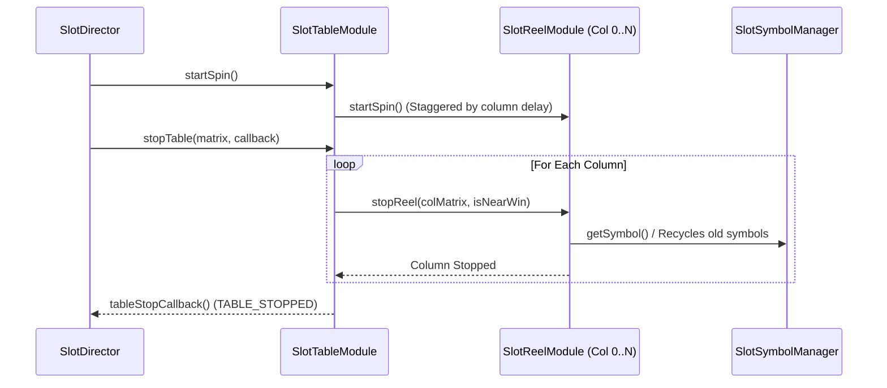

# SlotTableModule: Overview & Architecture

> **Source Path**: `assets/cc-common/cc-slot-module/BaseModule/Table/SlotTable/scripts/SlotTableModule.ts`  
> **Inheritance**: `SlotTableModule` ➔ `SlotBaseModule` ➔ `cc.Component`  
> **Online Reference**: [SlotTableModule on Enotion Platform](https://slot-platform.enostd.gay/api-references/base-slot/SlotCellTable.html)

---

## 1. Purpose & Architectural Role
`SlotTableModule` is the **central orchestrator for the slot reel matrix**:
* Manages column instantiation and coordinate placement of `SlotReelModule` instances based on `TableModuleConfig.TABLE_FORMAT`.
* Controls spin physics: starting roll sequences, stagger delays between columns, near-win anticipation delays, and bounce stop easing.
* Coordinates with `SlotSymbolManager` to populate, update, and clear matrix symbols across Normal, Free, and Cascade modes.

---

## 2. Table Spin Execution Flow

