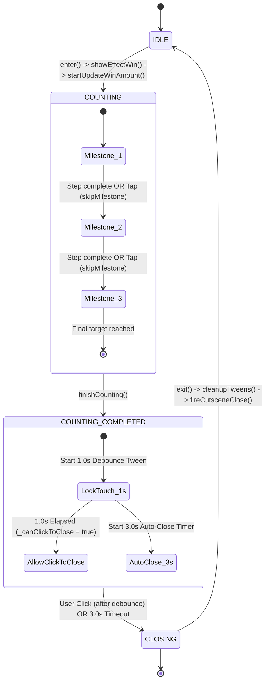
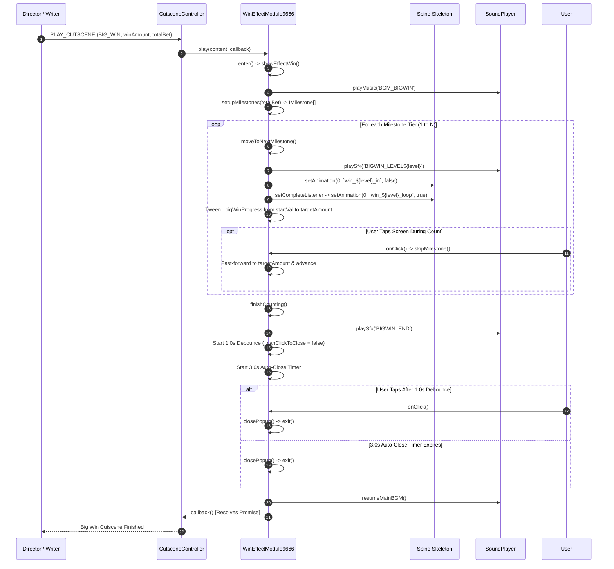

# 2. 🔄 State Machine & Lifecycle Flow

---

## 2.1 State Machine Specification

```typescript
export enum WinPopupState {
    IDLE = 0,               // Popup closed, uninitialized
    COUNTING = 1,           // Active money count-up tween in progress
    COUNTING_COMPLETED = 2, // Counting finished, in 1.0s debounce or 3.0s auto-close
    CLOSING = 3             // Teardown in progress, resolving callback
}
```



---

## 2.2 Sequence Diagram of Full Celebration Flow



---

## 2.3 Interactive Touch Rules
1. **Click Throttling**:
   - `now - this._lastClickTime < 300ms`: Ignored to prevent rapid-fire multi-touch gestures from glitching tweens.
2. **During `COUNTING`**:
   - Tapping immediately jumps current display value to `currentMilestone.targetAmount`.
   - Advances to next milestone if available, or immediately calls `finishCounting()`.
3. **During `COUNTING_COMPLETED`**:
   - First **1.0 second**: `_canClickToClose = false`. Taps are ignored to protect against accidental tap-throughs.
   - After **1.0 second**: `_canClickToClose = true`. Tapping instantly closes the popup.
   - After **3.0 seconds**: Auto-close executes if no player interaction occurs.
