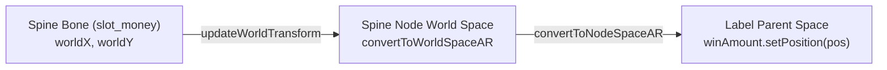

# 3. 🦴 Dynamic Spine Bone Tracking & Sync

---

## 3.1 The Coordinate Space Challenge
In custom slot animations, victory characters often jump, bounce, or shake the win board. If the win amount label is simply placed at a static `(0, 0)` position, it looks disjointed and floats unnaturally over moving graphics.

### The Problem:
- Spine bones calculate positions in **Spine local space**.
- UI Labels reside in **Node / Canvas space**.
- If parent nodes have scaling, resolution adaptation, or offsets, direct position copying produces severe coordinate misalignments.

---

## 3.2 Bone Tracking Algorithm



### Implementation:
```typescript
syncMoneyToSlot(): void {
    if (!this.bigWinSkeleton || !this.bigWinSkeleton.skeletonData || !this.winAmount || !this.winAmount.parent) {
        return;
    }

    // 1. Force skeleton to update world transformation matrices for current frame
    this.bigWinSkeleton.updateWorldTransform();

    // 2. Find the designated anchor bone
    const bone = this.bigWinSkeleton.findBone('slot_money');
    if (!bone) {
        return;
    }

    // 3. Transform bone local coords to Cocos World Space
    const worldPos = this.bigWinSkeleton.node.convertToWorldSpaceAR(cc.v2(bone.worldX, bone.worldY));

    // 4. Transform World Space coords into label parent's local space
    const targetPos = this.winAmount.parent.convertToNodeSpaceAR(worldPos);
    this.winAmount.setPosition(targetPos);
}

update(_dt: number): void {
    // Continuously sync every frame while entrance/transition animations are active
    if (this._isMoneySlotMoving) {
        this.syncMoneyToSlot();
    }
}
```

---

## 3.3 Spine Track & Mix Configuration

```typescript
private initSkeletonMix(): void {
    if (!this.bigWinSkeleton || !this.bigWinSkeleton.skeletonData) return;
    // Crossfade 0.2s between in and loop tracks to ensure smooth transitions
    this.bigWinSkeleton.setMix('win_1_in', 'win_1_loop', 0.2);
    this.bigWinSkeleton.setMix('win_2_in', 'win_2_loop', 0.2);
    this.bigWinSkeleton.setMix('win_3_in', 'win_3_loop', 0.2);
}

playLevelAnim(levelIndex: number): void {
    const level = levelIndex + 1;
    const inAnim = `win_${level}_in`;
    const loopAnim = `win_${level}_loop`;

    this.bigWinSkeleton.node.active = true;
    this.bigWinSkeleton.clearTracks();
    this.bigWinSkeleton.setToSetupPose();

    // Start entrance animation
    this.bigWinSkeleton.setAnimation(0, inAnim, false);
    this._isMoneySlotMoving = true;
    this.syncMoneyToSlot();

    // When entrance finishes, switch to idle loop
    this.bigWinSkeleton.setCompleteListener((trackEntry: any) => {
        if (trackEntry && trackEntry.animation && trackEntry.animation.name === inAnim) {
            this.bigWinSkeleton.setCompleteListener(() => { });
            this._isMoneySlotMoving = false;
            this.syncMoneyToSlot();
            this.bigWinSkeleton.setAnimation(0, loopAnim, true);
        }
    });
}
```
